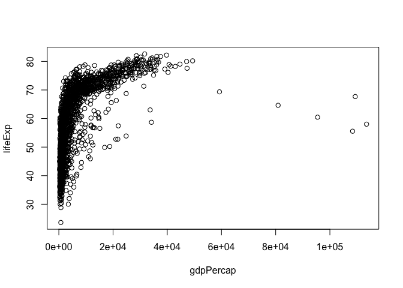
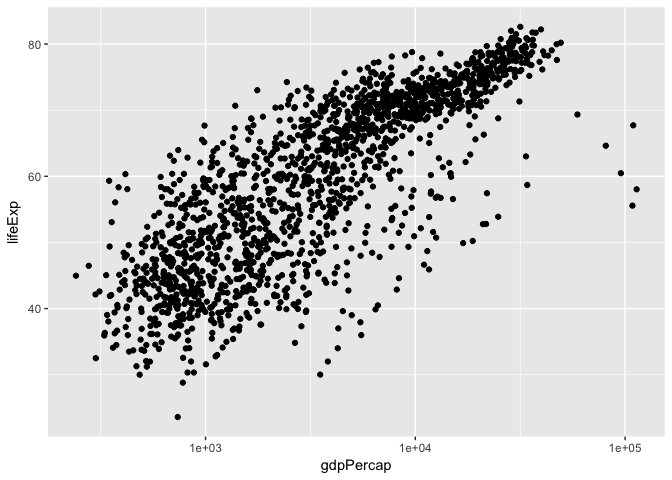
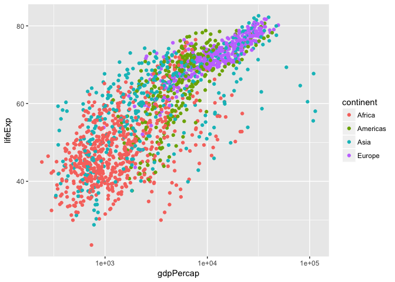

hw01\_gapminder
================
Peter Whitman
9/17/2017

``` r
library(gapminder)
library(tidyverse)
```

    ## Loading tidyverse: ggplot2
    ## Loading tidyverse: tibble
    ## Loading tidyverse: tidyr
    ## Loading tidyverse: readr
    ## Loading tidyverse: purrr
    ## Loading tidyverse: dplyr

    ## Conflicts with tidy packages ----------------------------------------------

    ## filter(): dplyr, stats
    ## lag():    dplyr, stats

``` r
plot(lifeExp ~ year, gapminder)
```


``` r
plot(lifeExp ~ gdpPercap, gapminder)
```



``` r
plot(lifeExp ~ log(gdpPercap), gapminder)
```


``` r
summary(gapminder$lifeExp)
```

    ##    Min. 1st Qu.  Median    Mean 3rd Qu.    Max. 
    ##   23.60   48.20   60.71   59.47   70.85   82.60

``` r
hist(gapminder$lifeExp)
```


``` r
barplot(table(gapminder$continent))
```


``` r
p <- ggplot(filter(gapminder, continent != "Oceania"),
            aes(x = gdpPercap, y = lifeExp)) # just initializes
p <- p + scale_x_log10() # log the x axis the right way
p + geom_point() # scatterplot
```



``` r
p + geom_point(aes(color = continent)) # map continent to color
```



``` r
p + geom_point(alpha = (1/3), size = 3) + geom_smooth(lwd = 3, se = FALSE)
```

    ## `geom_smooth()` using method = 'gam'


``` r
p + geom_point(alpha = (1/3), size = 3) + facet_wrap(~ continent) +
  geom_smooth(lwd = 1.5, se = FALSE)
```

    ## `geom_smooth()` using method = 'loess'


