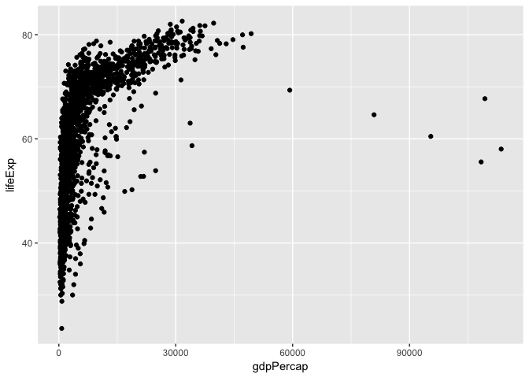
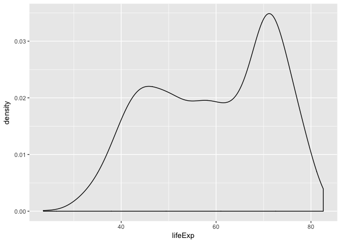
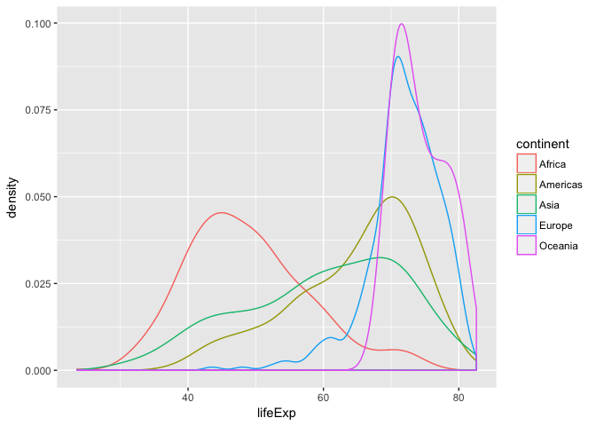
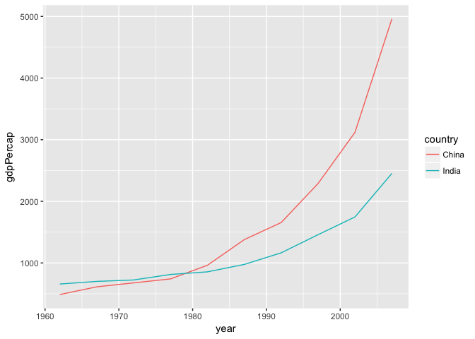

hw02
================
Peter Whitman
9/30/2017

``` r
library(gapminder)
library(tidyverse)
```

    ## Loading tidyverse: ggplot2
    ## Loading tidyverse: tibble
    ## Loading tidyverse: tidyr
    ## Loading tidyverse: readr
    ## Loading tidyverse: purrr
    ## Loading tidyverse: dplyr

    ## Conflicts with tidy packages ----------------------------------------------

    ## filter(): dplyr, stats
    ## lag():    dplyr, stats

``` r
library(knitr)
```

### Smell test the data

``` r
str(gapminder)
```

    ## Classes 'tbl_df', 'tbl' and 'data.frame':    1704 obs. of  6 variables:
    ##  $ country  : Factor w/ 142 levels "Afghanistan",..: 1 1 1 1 1 1 1 1 1 1 ...
    ##  $ continent: Factor w/ 5 levels "Africa","Americas",..: 3 3 3 3 3 3 3 3 3 3 ...
    ##  $ year     : int  1952 1957 1962 1967 1972 1977 1982 1987 1992 1997 ...
    ##  $ lifeExp  : num  28.8 30.3 32 34 36.1 ...
    ##  $ pop      : int  8425333 9240934 10267083 11537966 13079460 14880372 12881816 13867957 16317921 22227415 ...
    ##  $ gdpPercap: num  779 821 853 836 740 ...

-   Is it a data.frame, a matrix, a vector, a list? *data.frame*
-   What’s its class? *tbl\_df*
-   How many variables/columns? *6*
-   How many rows/observations? *1704*
-   Can you get these facts about “extent” or “size” in more than one way? Can you imagine different functions being useful in different contexts?

``` r
class(gapminder)
```

    ## [1] "tbl_df"     "tbl"        "data.frame"

``` r
nrow(gapminder)
```

    ## [1] 1704

``` r
ncol(gapminder)
```

    ## [1] 6

*I can imagine that the alternative methods I've shown above would be useful if a user was quickly trying to become acquainted with a dataset. Emplying ncol or nrow would give you information about the extent of the dataset without all of the other somewhat superfluous information*

-   What data type is each variable?

``` r
typeof(gapminder$country)
```

    ## [1] "integer"

``` r
typeof(gapminder$continent)
```

    ## [1] "integer"

``` r
typeof(gapminder$lifeExp)
```

    ## [1] "double"

``` r
typeof(gapminder$year)
```

    ## [1] "integer"

``` r
typeof(gapminder$pop)
```

    ## [1] "integer"

``` r
typeof(gapminder$gdpPercap)
```

    ## [1] "double"

### Explore individual variables

-   What are possible values (or range, whichever is appropriate) of each variable?

``` r
summary(gapminder)
```

    ##         country        continent        year         lifeExp     
    ##  Afghanistan:  12   Africa  :624   Min.   :1952   Min.   :23.60  
    ##  Albania    :  12   Americas:300   1st Qu.:1966   1st Qu.:48.20  
    ##  Algeria    :  12   Asia    :396   Median :1980   Median :60.71  
    ##  Angola     :  12   Europe  :360   Mean   :1980   Mean   :59.47  
    ##  Argentina  :  12   Oceania : 24   3rd Qu.:1993   3rd Qu.:70.85  
    ##  Australia  :  12                  Max.   :2007   Max.   :82.60  
    ##  (Other)    :1632                                                
    ##       pop              gdpPercap       
    ##  Min.   :6.001e+04   Min.   :   241.2  
    ##  1st Qu.:2.794e+06   1st Qu.:  1202.1  
    ##  Median :7.024e+06   Median :  3531.8  
    ##  Mean   :2.960e+07   Mean   :  7215.3  
    ##  3rd Qu.:1.959e+07   3rd Qu.:  9325.5  
    ##  Max.   :1.319e+09   Max.   :113523.1  
    ## 

-   What values are typical? What’s the spread? What’s the distribution? Etc., tailored to the variable at hand.

``` r
barplot(table(gapminder$continent))
```


``` r
hist(gapminder$lifeExp)
```


### Explore various plot types

-   A scatterplot of two quantitative variables.

``` r
p2 <- ggplot(gapminder, aes(x=gdpPercap, y=lifeExp))
p2 + geom_point()
```



-   A plot of one quantitative variable. Maybe a histogram or densityplot or frequency polygon.

``` r
p3 <- ggplot(gapminder, aes(x=lifeExp)) 
p3 + geom_density(alpha=0.3)
```



-   A plot of one quantitative variable and one categorical. Maybe boxplots for several continents or countries.

``` r
p3 <- ggplot(gapminder, aes(x=lifeExp, color=continent)) 
p3 + geom_density(alpha=0.3)
```



### Use filter(), select() and %&gt;%

-   Use filter() to create data subsets that you want to plot

``` r
filter(gapminder, year %in% 1970:1972 & country == "Albania")
```

    ## # A tibble: 1 x 6
    ##   country continent  year lifeExp     pop gdpPercap
    ##    <fctr>    <fctr> <int>   <dbl>   <int>     <dbl>
    ## 1 Albania    Europe  1972   67.69 2263554  3313.422

``` r
filter(gapminder, pop > 500000000)
```

    ## # A tibble: 21 x 6
    ##    country continent  year  lifeExp        pop gdpPercap
    ##     <fctr>    <fctr> <int>    <dbl>      <int>     <dbl>
    ##  1   China      Asia  1952 44.00000  556263527  400.4486
    ##  2   China      Asia  1957 50.54896  637408000  575.9870
    ##  3   China      Asia  1962 44.50136  665770000  487.6740
    ##  4   China      Asia  1967 58.38112  754550000  612.7057
    ##  5   China      Asia  1972 63.11888  862030000  676.9001
    ##  6   China      Asia  1977 63.96736  943455000  741.2375
    ##  7   China      Asia  1982 65.52500 1000281000  962.4214
    ##  8   China      Asia  1987 67.27400 1084035000 1378.9040
    ##  9   China      Asia  1992 68.69000 1164970000 1655.7842
    ## 10   China      Asia  1997 70.42600 1230075000 2289.2341
    ## # ... with 11 more rows

-   Practice piping together filter() and select(). Possibly even piping into ggplot().

``` r
t1 <- ggplot(gapminder %>% filter(country == "China" | country == "India", year > 1960) %>% select(country, year, gdpPercap), aes(x=year, y=gdpPercap, color = country)) 
t1 + geom_line()
```



### But I want to do more!

-   Present numerical tables in a more attractive form, such as using knitr::kable().

``` r
kable(filter(gapminder, country == "Algeria" & year < "1960"))
```

| country | continent |  year|  lifeExp|       pop|  gdpPercap|
|:--------|:----------|-----:|--------:|---------:|----------:|
| Algeria | Africa    |  1952|   43.077|   9279525|   2449.008|
| Algeria | Africa    |  1957|   45.685|  10270856|   3013.976|

-   Evaluate this code and describe the result. Presumably the analyst’s intent was to get the data for Rwanda and Afghanistan. Did they succeed? Why or why not? If not, what is the correct way to do this?

``` r
filter(gapminder, country == c("Rwanda", "Afghanistan"))
```

    ## # A tibble: 12 x 6
    ##        country continent  year lifeExp      pop gdpPercap
    ##         <fctr>    <fctr> <int>   <dbl>    <int>     <dbl>
    ##  1 Afghanistan      Asia  1957  30.332  9240934  820.8530
    ##  2 Afghanistan      Asia  1967  34.020 11537966  836.1971
    ##  3 Afghanistan      Asia  1977  38.438 14880372  786.1134
    ##  4 Afghanistan      Asia  1987  40.822 13867957  852.3959
    ##  5 Afghanistan      Asia  1997  41.763 22227415  635.3414
    ##  6 Afghanistan      Asia  2007  43.828 31889923  974.5803
    ##  7      Rwanda    Africa  1952  40.000  2534927  493.3239
    ##  8      Rwanda    Africa  1962  43.000  3051242  597.4731
    ##  9      Rwanda    Africa  1972  44.600  3992121  590.5807
    ## 10      Rwanda    Africa  1982  46.218  5507565  881.5706
    ## 11      Rwanda    Africa  1992  23.599  7290203  737.0686
    ## 12      Rwanda    Africa  2002  43.413  7852401  785.6538

*This code chunk produces all data for Afghanistan and Rwanda. The analyst did succeed, if that was their intent.*
