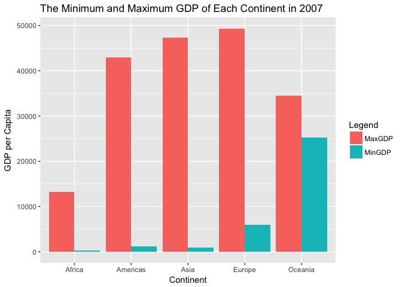
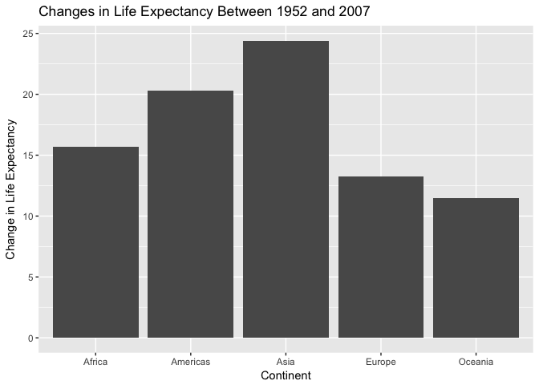
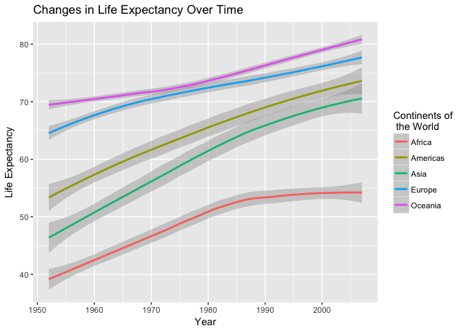
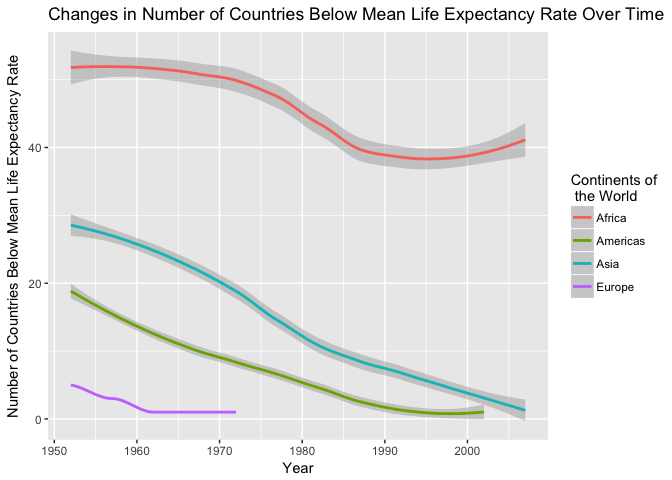

hw03
================
Peter Whitman
9/30/2017

Task Menu
---------

-   Get the maximum and minimum of GDP per capita for all continents.

``` r
gapminder %>% 
  group_by(continent) %>% filter(year == 2007) %>% summarize(MaxGDP = max(gdpPercap), MinGDP = min(gdpPercap)) 
```

    ## # A tibble: 5 x 3
    ##   continent   MaxGDP     MinGDP
    ##      <fctr>    <dbl>      <dbl>
    ## 1    Africa 13206.48   277.5519
    ## 2  Americas 42951.65  1201.6372
    ## 3      Asia 47306.99   944.0000
    ## 4    Europe 49357.19  5937.0295
    ## 5   Oceania 34435.37 25185.0091

*Above is a table that lists the maximum and minimum GDP/capita for each continent in 2007. I thought that focusing on a specific survey year would minimize distortions associated with things like inflation*

``` r
p1 <- gapminder %>% 
  group_by(continent) %>% filter(year == 2007) %>% summarize(MaxGDP = max(gdpPercap), MinGDP = min(gdpPercap)) 
p2 <- p1 %>%
    group_by(continent) %>%
    summarise(MaxGDP = sum(MaxGDP), MinGDP = sum(MinGDP))
p3 <- p2 %>% gather(Legend, gdpPercapita, -continent)
ggplot(p3, aes(x = continent, fill = Legend, y = gdpPercapita)) +
    geom_col(position = "dodge") + labs(x="Continent", 
          y="GDP per Capita",
          title="The Minimum and Maximum GDP of Each Continent in 2007") 
```



*Above is a bar chart that compares the maximum and minimum GDP/capita for each continent in 2007. It took a bit of time to figure out how to get the bars to not stack, which is the default. This is where the (position = "dodge") came in.*

-   How is life expectancy changing over time on different continents?

``` r
gapminder %>% 
  group_by(continent) %>% summarize(life_change = mean(lifeExp[year == 2007] - lifeExp[year == 1952]))
```

    ## # A tibble: 5 x 2
    ##   continent life_change
    ##      <fctr>       <dbl>
    ## 1    Africa    15.67054
    ## 2  Americas    20.32828
    ## 3      Asia    24.41409
    ## 4    Europe    13.24010
    ## 5   Oceania    11.46450

*The above table depicts the change in life expectancy rate between 1952 and 2007 for each continent*

``` r
p4 <- gapminder %>% 
  group_by(continent) %>% summarize(life_change = mean(lifeExp[year == 2007] - lifeExp[year == 1952])) %>% ggplot(aes(continent, life_change))
p4 + geom_col() + labs(x="Continent", 
          y="Change in Life Expectancy",
          title="Changes in Life Expectancy Between 1952 and 2007") 
```



*Above is a bar chart the depicts the data presented in the table*

``` r
gapminder %>% group_by(continent) %>% ggplot(aes(year, lifeExp, color = continent)) + geom_smooth() + labs(x="Year", 
          y="Life Expectancy",
          title="Changes in Life Expectancy Over Time") + scale_colour_discrete("Continents of\n the World")
```

    ## `geom_smooth()` using method = 'loess'



*I found that this figure depicts how life expectancy has changed over time better than total change depicted in the bar graph above*

-   Report the absolute and/or relative abundance of countries with low life expectancy over time by continent: Compute some measure of worldwide life expectancy – you decide – a mean or median or some other quantile or perhaps your current age. Then determine how many countries on each continent have a life expectancy less than this benchmark, for each year.

``` r
gapminder %>% summarize(mean(lifeExp))
```

    ## # A tibble: 1 x 1
    ##   `mean(lifeExp)`
    ##             <dbl>
    ## 1        59.47444

*This is the mean life expectancy rate computed from all 1704 life expectancy entries*

``` r
gapminder %>% mutate(benchmark=c("below", "over")[(lifeExp>59.4744) + 1]) %>% group_by(year) %>% filter(benchmark == "below") %>% count(benchmark) 
```

    ## # A tibble: 12 x 3
    ## # Groups:   year [12]
    ##     year benchmark     n
    ##    <int>     <chr> <int>
    ##  1  1952     below   105
    ##  2  1957     below    96
    ##  3  1962     below    90
    ##  4  1967     below    84
    ##  5  1972     below    78
    ##  6  1977     below    70
    ##  7  1982     below    59
    ##  8  1987     below    49
    ##  9  1992     below    46
    ## 10  1997     below    46
    ## 11  2002     below    45
    ## 12  2007     below    41

*This table provides the number of countries in each year that fall below the mean life expectancy rate*

``` r
gapminder %>% mutate(benchmark=c("below", "over")[(lifeExp>59.4744) + 1]) %>% group_by(year) %>% filter(benchmark=="below") %>% count(benchmark) %>% ggplot(aes(year,n)) + geom_col() + labs(x="Year", 
          y="Number of Countries",
          title="Number of Countries Below the Mean Life Expectancy Rate Each Year")
```


*This bar chart provides a depiction of the data found in the table above*

``` r
gapminder %>% mutate(benchmark=c("below", "over")[(lifeExp>59.4744) + 1]) %>% group_by(continent) %>% filter(benchmark == "below") %>% count(benchmark, year)
```

    ## # A tibble: 40 x 4
    ## # Groups:   continent [4]
    ##    continent benchmark  year     n
    ##       <fctr>     <chr> <int> <int>
    ##  1    Africa     below  1952    52
    ##  2    Africa     below  1957    52
    ##  3    Africa     below  1962    51
    ##  4    Africa     below  1967    50
    ##  5    Africa     below  1972    50
    ##  6    Africa     below  1977    49
    ##  7    Africa     below  1982    43
    ##  8    Africa     below  1987    39
    ##  9    Africa     below  1992    38
    ## 10    Africa     below  1997    39
    ## # ... with 30 more rows

*Here I've computed the number of countries that fall below the mean life expectancy rate in each year by continent*

``` r
gapminder %>% mutate(benchmark=c("below", "over")[(lifeExp>59.4744) + 1]) %>% group_by(continent) %>% filter(benchmark == "below") %>% count(benchmark, year) %>% ggplot(aes(year, n, color = continent)) + geom_smooth() + labs(x="Year", 
          y="Number of Countries Below Mean Life Expectancy Rate",
          title="Changes in Number of Countries Below Mean Life Expectancy Rate Over Time") + scale_colour_discrete("Continents of\n the World")
```

    ## `geom_smooth()` using method = 'loess'

    ## Warning in simpleLoess(y, x, w, span, degree = degree, parametric =
    ## parametric, : span too small. fewer data values than degrees of freedom.

    ## Warning in simpleLoess(y, x, w, span, degree = degree, parametric =
    ## parametric, : pseudoinverse used at 1951.9

    ## Warning in simpleLoess(y, x, w, span, degree = degree, parametric =
    ## parametric, : neighborhood radius 10.1

    ## Warning in simpleLoess(y, x, w, span, degree = degree, parametric =
    ## parametric, : reciprocal condition number 0

    ## Warning in simpleLoess(y, x, w, span, degree = degree, parametric =
    ## parametric, : There are other near singularities as well. 102.01

    ## Warning in predLoess(object$y, object$x, newx = if
    ## (is.null(newdata)) object$x else if (is.data.frame(newdata))
    ## as.matrix(model.frame(delete.response(terms(object)), : span too small.
    ## fewer data values than degrees of freedom.

    ## Warning in predLoess(object$y, object$x, newx = if
    ## (is.null(newdata)) object$x else if (is.data.frame(newdata))
    ## as.matrix(model.frame(delete.response(terms(object)), : pseudoinverse used
    ## at 1951.9

    ## Warning in predLoess(object$y, object$x, newx = if
    ## (is.null(newdata)) object$x else if (is.data.frame(newdata))
    ## as.matrix(model.frame(delete.response(terms(object)), : neighborhood radius
    ## 10.1

    ## Warning in predLoess(object$y, object$x, newx = if
    ## (is.null(newdata)) object$x else if (is.data.frame(newdata))
    ## as.matrix(model.frame(delete.response(terms(object)), : reciprocal
    ## condition number 0

    ## Warning in predLoess(object$y, object$x, newx = if
    ## (is.null(newdata)) object$x else if (is.data.frame(newdata))
    ## as.matrix(model.frame(delete.response(terms(object)), : There are other
    ## near singularities as well. 102.01



*Interestingly, Oceania is not present in this figure, which must mean that none of the countries that make up Oceania had life expectancy rates lower than the mean*
