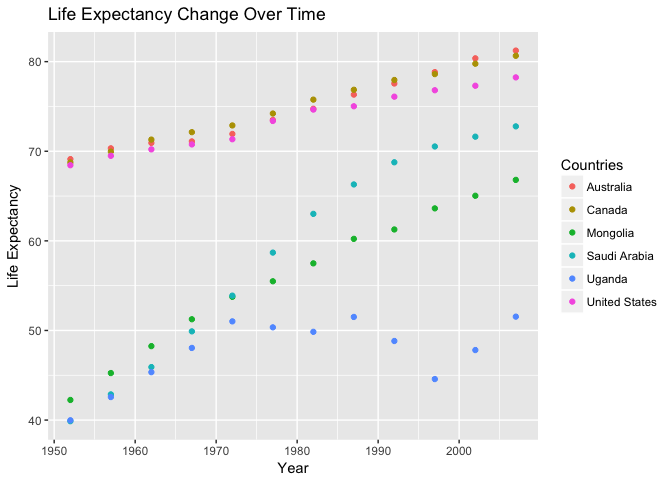
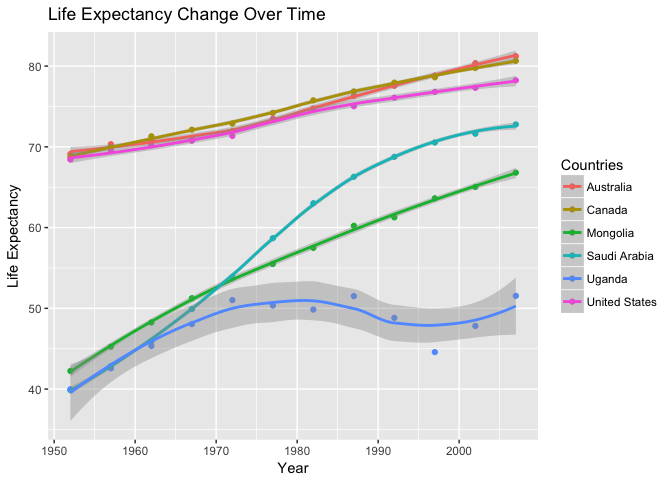
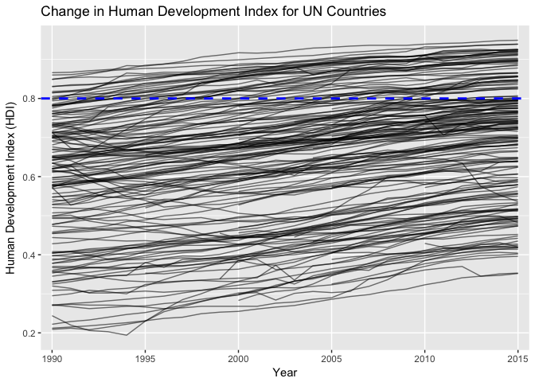
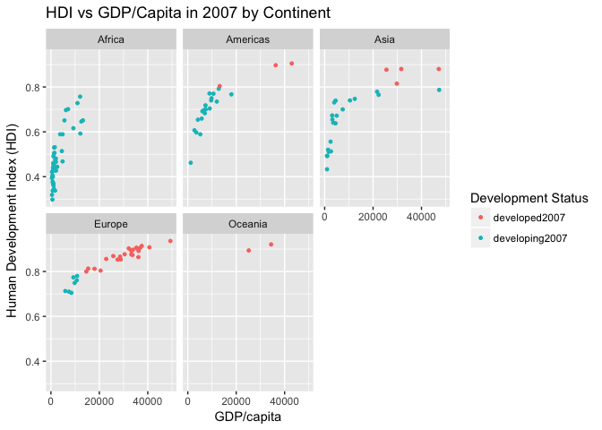
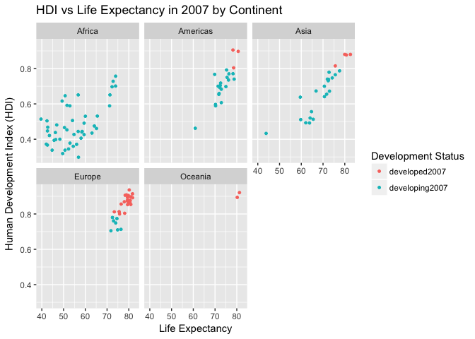
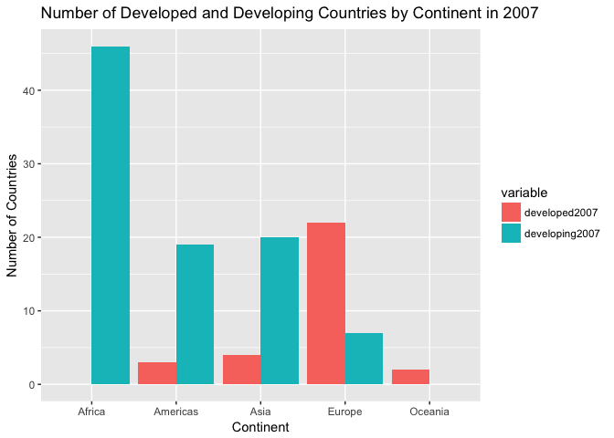
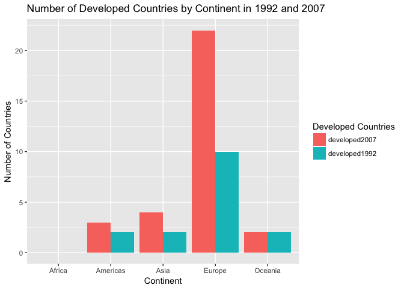

hw04
================
Peter Whitman
10/9/2017

``` r
library(gapminder)
library(knitr)
library(tidyverse)
```

    ## Loading tidyverse: ggplot2
    ## Loading tidyverse: tibble
    ## Loading tidyverse: tidyr
    ## Loading tidyverse: readr
    ## Loading tidyverse: purrr
    ## Loading tidyverse: dplyr

    ## Conflicts with tidy packages ----------------------------------------------

    ## filter(): dplyr, stats
    ## lag():    dplyr, stats

``` r
library(reshape2)
```

    ## 
    ## Attaching package: 'reshape2'

    ## The following object is masked from 'package:tidyr':
    ## 
    ##     smiths

``` r
library(devtools)
library(readxl)
library(tidyr)
```

1. General data reshaping and relationship to aggregation
=========================================================

#### Make a tibble with one row per year and columns for life expectancy for two or more countries.

-   Use knitr::kable() to make this table look pretty in your rendered homework.
-   Take advantage of this new data shape to scatterplot life expectancy for one country against that of another.

``` r
df.1 <- gapminder %>% filter(country == "Canada" | country == "United States" | country == "Uganda" | country == "Australia" | country == "Mongolia" | country == "Saudi Arabia") %>% select(year, country, lifeExp) %>% spread(key = country, value = lifeExp) 
kable(df.1)
```

|  year|  Australia|  Canada|  Mongolia|  Saudi Arabia|  Uganda|  United States|
|-----:|----------:|-------:|---------:|-------------:|-------:|--------------:|
|  1952|     69.120|  68.750|    42.244|        39.875|  39.978|         68.440|
|  1957|     70.330|  69.960|    45.248|        42.868|  42.571|         69.490|
|  1962|     70.930|  71.300|    48.251|        45.914|  45.344|         70.210|
|  1967|     71.100|  72.130|    51.253|        49.901|  48.051|         70.760|
|  1972|     71.930|  72.880|    53.754|        53.886|  51.016|         71.340|
|  1977|     73.490|  74.210|    55.491|        58.690|  50.350|         73.380|
|  1982|     74.740|  75.760|    57.489|        63.012|  49.849|         74.650|
|  1987|     76.320|  76.860|    60.222|        66.295|  51.509|         75.020|
|  1992|     77.560|  77.950|    61.271|        68.768|  48.825|         76.090|
|  1997|     78.830|  78.610|    63.625|        70.533|  44.578|         76.810|
|  2002|     80.370|  79.770|    65.033|        71.626|  47.813|         77.310|
|  2007|     81.235|  80.653|    66.803|        72.777|  51.542|         78.242|

*Above is a tibble with one row per year and columns for life expectancy for two or more countries. The table is made pretty by the use of kable*

``` r
df.2 <- melt(df.1, id.vars = "year")
kable(df.2)
```

|  year| variable      |   value|
|-----:|:--------------|-------:|
|  1952| Australia     |  69.120|
|  1957| Australia     |  70.330|
|  1962| Australia     |  70.930|
|  1967| Australia     |  71.100|
|  1972| Australia     |  71.930|
|  1977| Australia     |  73.490|
|  1982| Australia     |  74.740|
|  1987| Australia     |  76.320|
|  1992| Australia     |  77.560|
|  1997| Australia     |  78.830|
|  2002| Australia     |  80.370|
|  2007| Australia     |  81.235|
|  1952| Canada        |  68.750|
|  1957| Canada        |  69.960|
|  1962| Canada        |  71.300|
|  1967| Canada        |  72.130|
|  1972| Canada        |  72.880|
|  1977| Canada        |  74.210|
|  1982| Canada        |  75.760|
|  1987| Canada        |  76.860|
|  1992| Canada        |  77.950|
|  1997| Canada        |  78.610|
|  2002| Canada        |  79.770|
|  2007| Canada        |  80.653|
|  1952| Mongolia      |  42.244|
|  1957| Mongolia      |  45.248|
|  1962| Mongolia      |  48.251|
|  1967| Mongolia      |  51.253|
|  1972| Mongolia      |  53.754|
|  1977| Mongolia      |  55.491|
|  1982| Mongolia      |  57.489|
|  1987| Mongolia      |  60.222|
|  1992| Mongolia      |  61.271|
|  1997| Mongolia      |  63.625|
|  2002| Mongolia      |  65.033|
|  2007| Mongolia      |  66.803|
|  1952| Saudi Arabia  |  39.875|
|  1957| Saudi Arabia  |  42.868|
|  1962| Saudi Arabia  |  45.914|
|  1967| Saudi Arabia  |  49.901|
|  1972| Saudi Arabia  |  53.886|
|  1977| Saudi Arabia  |  58.690|
|  1982| Saudi Arabia  |  63.012|
|  1987| Saudi Arabia  |  66.295|
|  1992| Saudi Arabia  |  68.768|
|  1997| Saudi Arabia  |  70.533|
|  2002| Saudi Arabia  |  71.626|
|  2007| Saudi Arabia  |  72.777|
|  1952| Uganda        |  39.978|
|  1957| Uganda        |  42.571|
|  1962| Uganda        |  45.344|
|  1967| Uganda        |  48.051|
|  1972| Uganda        |  51.016|
|  1977| Uganda        |  50.350|
|  1982| Uganda        |  49.849|
|  1987| Uganda        |  51.509|
|  1992| Uganda        |  48.825|
|  1997| Uganda        |  44.578|
|  2002| Uganda        |  47.813|
|  2007| Uganda        |  51.542|
|  1952| United States |  68.440|
|  1957| United States |  69.490|
|  1962| United States |  70.210|
|  1967| United States |  70.760|
|  1972| United States |  71.340|
|  1977| United States |  73.380|
|  1982| United States |  74.650|
|  1987| United States |  75.020|
|  1992| United States |  76.090|
|  1997| United States |  76.810|
|  2002| United States |  77.310|
|  2007| United States |  78.242|

*Here is the same information seen in the first tibble, but outputed in long format. This will allow me to construct a scatterplot with life expectancy (value) on the y axis, year on x axis, and countries represented by color*

``` r
graph1 <- df.2 %>% ggplot(aes(year, value, color = variable)) + geom_point() + labs(x = "Year", y = "Life Expectancy", title = "Life Expectancy Change Over Time") + scale_colour_discrete("Countries")
graph1
```



*This is a scatterplot that depicts the change in life expectancy for each selected country between 1952 and 2007*

``` r
graph1 + geom_smooth() 
```

    ## `geom_smooth()` using method = 'loess'



*Here is the same figure, but outputed using geom\_smooth, which helps the viewer understand the trends in the data*

2. Join, merge, look up
=======================

#### Create a second data frame, complementary to Gapminder. Join this with (part of) Gapminder using a dplyr join function and make some observations about the process and result. Explore the different types of joins. Examples of a second data frame you could build:

``` r
HDI <- read_excel("HumanDevelopmentIndex.xlsx")
glimpse(HDI)
```

    ## Observations: 188
    ## Variables: 28
    ## $ `HDI Rank (2015)` <dbl> 169, 75, 83, 32, 150, 62, 45, 84, 2, 24, 78,...
    ## $ Country           <chr> "Afghanistan", "Albania", "Algeria", "Andorr...
    ## $ `1990`            <dbl> 0.295, 0.635, 0.577, NA, NA, NA, 0.705, 0.63...
    ## $ `1991`            <dbl> 0.300, 0.618, 0.581, NA, NA, NA, 0.713, 0.62...
    ## $ `1992`            <dbl> 0.309, 0.603, 0.587, NA, NA, NA, 0.720, 0.59...
    ## $ `1993`            <dbl> 0.305, 0.608, 0.591, NA, NA, NA, 0.725, 0.59...
    ## $ `1994`            <dbl> 0.300, 0.616, 0.595, NA, NA, NA, 0.728, 0.59...
    ## $ `1995`            <dbl> 0.324, 0.628, 0.600, NA, NA, NA, 0.731, 0.60...
    ## $ `1996`            <dbl> 0.328, 0.637, 0.609, NA, NA, NA, 0.738, 0.60...
    ## $ `1997`            <dbl> 0.332, 0.636, 0.617, NA, NA, NA, 0.746, 0.61...
    ## $ `1998`            <dbl> 0.335, 0.646, 0.627, NA, NA, NA, 0.753, 0.63...
    ## $ `1999`            <dbl> 0.338, 0.656, 0.636, NA, 0.382, NA, 0.764, 0...
    ## $ `2000`            <dbl> 0.340, 0.662, 0.644, NA, 0.391, NA, 0.771, 0...
    ## $ `2001`            <dbl> 0.341, 0.670, 0.653, NA, 0.401, NA, 0.776, 0...
    ## $ `2002`            <dbl> 0.373, 0.674, 0.663, NA, 0.406, NA, 0.770, 0...
    ## $ `2003`            <dbl> 0.381, 0.681, 0.673, NA, 0.415, NA, 0.775, 0...
    ## $ `2004`            <dbl> 0.396, 0.685, 0.680, NA, 0.426, NA, 0.780, 0...
    ## $ `2005`            <dbl> 0.405, 0.696, 0.686, NA, 0.439, 0.773, 0.782...
    ## $ `2006`            <dbl> 0.415, 0.703, 0.690, NA, 0.454, 0.781, 0.788...
    ## $ `2007`            <dbl> 0.433, 0.713, 0.697, NA, 0.468, 0.786, 0.792...
    ## $ `2008`            <dbl> 0.434, 0.721, 0.705, NA, 0.480, 0.788, 0.794...
    ## $ `2009`            <dbl> 0.448, 0.725, 0.714, NA, 0.488, 0.783, 0.802...
    ## $ `2010`            <dbl> 0.454, 0.738, 0.724, 0.819, 0.495, 0.782, 0....
    ## $ `2011`            <dbl> 0.463, 0.752, 0.732, 0.819, 0.508, 0.778, 0....
    ## $ `2012`            <dbl> 0.470, 0.759, 0.737, 0.843, 0.523, 0.781, 0....
    ## $ `2013`            <dbl> 0.476, 0.761, 0.741, 0.850, 0.527, 0.782, 0....
    ## $ `2014`            <dbl> 0.479, 0.762, 0.743, 0.857, 0.531, 0.784, 0....
    ## $ `2015`            <dbl> 0.479, 0.764, 0.745, 0.858, 0.533, 0.786, 0....

*This provides a brief glimpse of the properties of the data frame that I used for the second task. It is table that depicts the changes in human development index (HDI) between 1990 and 2015 for all UN countries. The table consists of 28 variables and 188 observations*

``` r
viz1 <- gather(HDI, "year", "HDI", 3:28) %>% select(Country, year, HDI) %>% filter(!is.na(HDI)) %>% group_by(Country)
viz1
```

    ## # A tibble: 4,348 x 3
    ## # Groups:   Country [188]
    ##        Country  year   HDI
    ##          <chr> <chr> <dbl>
    ##  1 Afghanistan  1990 0.295
    ##  2     Albania  1990 0.635
    ##  3     Algeria  1990 0.577
    ##  4   Argentina  1990 0.705
    ##  5     Armenia  1990 0.634
    ##  6   Australia  1990 0.866
    ##  7     Austria  1990 0.794
    ##  8     Bahrain  1990 0.745
    ##  9  Bangladesh  1990 0.386
    ## 10    Barbados  1990 0.714
    ## # ... with 4,338 more rows

*In an effort to allow the viewer a better understanding of the dataset, I have reshaped the dataset for easier visualization with ggplot. The above table is in long format*

``` r
viz1 %>% ggplot(aes(year, HDI)) + geom_line(aes(group=Country, alpha = 4)) + labs(title = "Change in Human Development Index for UN Countries", y= "Human Development Index (HDI)", x = "Year") + scale_x_discrete( breaks=c(1990, 1995, 2000, 2005, 2010, 2015)) + theme(legend.position="none") + geom_hline(yintercept=0.8,
               linetype="dashed", color = "blue", size = 1)
```



*Here I have outputed the HDI data using ggplot. Each line represents one country. The dashed line represents the threshold that the UN uses to dilineate developed countries from developing countries*

``` r
p1 <- left_join(gapminder, HDI, by = c("country" = "Country"))
```

    ## Warning: Column `country`/`Country` joining factor and character vector,
    ## coercing into character vector

``` r
p1
```

    ## # A tibble: 1,704 x 33
    ##        country continent  year lifeExp      pop gdpPercap
    ##          <chr>    <fctr> <int>   <dbl>    <int>     <dbl>
    ##  1 Afghanistan      Asia  1952  28.801  8425333  779.4453
    ##  2 Afghanistan      Asia  1957  30.332  9240934  820.8530
    ##  3 Afghanistan      Asia  1962  31.997 10267083  853.1007
    ##  4 Afghanistan      Asia  1967  34.020 11537966  836.1971
    ##  5 Afghanistan      Asia  1972  36.088 13079460  739.9811
    ##  6 Afghanistan      Asia  1977  38.438 14880372  786.1134
    ##  7 Afghanistan      Asia  1982  39.854 12881816  978.0114
    ##  8 Afghanistan      Asia  1987  40.822 13867957  852.3959
    ##  9 Afghanistan      Asia  1992  41.674 16317921  649.3414
    ## 10 Afghanistan      Asia  1997  41.763 22227415  635.3414
    ## # ... with 1,694 more rows, and 27 more variables: `HDI Rank
    ## #   (2015)` <dbl>, `1990` <dbl>, `1991` <dbl>, `1992` <dbl>, `1993` <dbl>,
    ## #   `1994` <dbl>, `1995` <dbl>, `1996` <dbl>, `1997` <dbl>, `1998` <dbl>,
    ## #   `1999` <dbl>, `2000` <dbl>, `2001` <dbl>, `2002` <dbl>, `2003` <dbl>,
    ## #   `2004` <dbl>, `2005` <dbl>, `2006` <dbl>, `2007` <dbl>, `2008` <dbl>,
    ## #   `2009` <dbl>, `2010` <dbl>, `2011` <dbl>, `2012` <dbl>, `2013` <dbl>,
    ## #   `2014` <dbl>, `2015` <dbl>

*Here I have joined the HDI data to the gapminder data by country using a left\_join*

``` r
dev1 <- p1 %>% filter(year == 2007) %>% select(country, continent, lifeExp, pop, gdpPercap, `2007`) 
dev1
```

    ## # A tibble: 142 x 6
    ##        country continent lifeExp       pop  gdpPercap `2007`
    ##          <chr>    <fctr>   <dbl>     <int>      <dbl>  <dbl>
    ##  1 Afghanistan      Asia  43.828  31889923   974.5803  0.433
    ##  2     Albania    Europe  76.423   3600523  5937.0295  0.713
    ##  3     Algeria    Africa  72.301  33333216  6223.3675  0.697
    ##  4      Angola    Africa  42.731  12420476  4797.2313  0.468
    ##  5   Argentina  Americas  75.320  40301927 12779.3796  0.792
    ##  6   Australia   Oceania  81.235  20434176 34435.3674  0.921
    ##  7     Austria    Europe  79.829   8199783 36126.4927  0.864
    ##  8     Bahrain      Asia  75.635    708573 29796.0483  0.815
    ##  9  Bangladesh      Asia  64.062 150448339  1391.2538  0.520
    ## 10     Belgium    Europe  79.441  10392226 33692.6051  0.874
    ## # ... with 132 more rows

*I would like to take a look at the number of countries within each continent that fall above and bellow the development threshold in 2007. So, here I have filtered out all survey years except for 2007 and selected relevant variables*

``` r
dev2 <- dev1 %>% mutate(dev_threshold=c("developing2007", "developed2007")[(`2007` >= 0.800) + 1]) %>% filter(!is.na(`2007`))
dev2
```

    ## # A tibble: 123 x 7
    ##        country continent lifeExp       pop  gdpPercap `2007`
    ##          <chr>    <fctr>   <dbl>     <int>      <dbl>  <dbl>
    ##  1 Afghanistan      Asia  43.828  31889923   974.5803  0.433
    ##  2     Albania    Europe  76.423   3600523  5937.0295  0.713
    ##  3     Algeria    Africa  72.301  33333216  6223.3675  0.697
    ##  4      Angola    Africa  42.731  12420476  4797.2313  0.468
    ##  5   Argentina  Americas  75.320  40301927 12779.3796  0.792
    ##  6   Australia   Oceania  81.235  20434176 34435.3674  0.921
    ##  7     Austria    Europe  79.829   8199783 36126.4927  0.864
    ##  8     Bahrain      Asia  75.635    708573 29796.0483  0.815
    ##  9  Bangladesh      Asia  64.062 150448339  1391.2538  0.520
    ## 10     Belgium    Europe  79.441  10392226 33692.6051  0.874
    ## # ... with 113 more rows, and 1 more variables: dev_threshold <chr>

*Here I've created a development index (0.8), which is the threshold that the UN uses to determine whether or not a country is developed. I've also created a new column that lets us know whether or not a country is above or below the threshold in 2007*

``` r
lm.1 <- lm(dev2$`2007` ~ dev2$lifeExp)
summary(lm.1)
```

    ## 
    ## Call:
    ## lm(formula = dev2$`2007` ~ dev2$lifeExp)
    ## 
    ## Residuals:
    ##       Min        1Q    Median        3Q       Max 
    ## -0.222444 -0.060423  0.004441  0.057830  0.219226 
    ## 
    ## Coefficients:
    ##                Estimate Std. Error t value Pr(>|t|)    
    ## (Intercept)  -0.2233381  0.0428833  -5.208 7.93e-07 ***
    ## dev2$lifeExp  0.0130793  0.0006304  20.747  < 2e-16 ***
    ## ---
    ## Signif. codes:  0 '***' 0.001 '**' 0.01 '*' 0.05 '.' 0.1 ' ' 1
    ## 
    ## Residual standard error: 0.08474 on 121 degrees of freedom
    ## Multiple R-squared:  0.7806, Adjusted R-squared:  0.7788 
    ## F-statistic: 430.5 on 1 and 121 DF,  p-value: < 2.2e-16

``` r
lm.2 <- lm(dev2$`2007` ~ dev2$gdpPercap)
summary(lm.2)
```

    ## 
    ## Call:
    ## lm(formula = dev2$`2007` ~ dev2$gdpPercap)
    ## 
    ## Residuals:
    ##       Min        1Q    Median        3Q       Max 
    ## -0.268401 -0.072222 -0.002416  0.090983  0.171992 
    ## 
    ## Coefficients:
    ##                 Estimate Std. Error t value Pr(>|t|)    
    ## (Intercept)    5.154e-01  1.232e-02   41.83   <2e-16 ***
    ## dev2$gdpPercap 1.141e-05  6.953e-07   16.42   <2e-16 ***
    ## ---
    ## Signif. codes:  0 '***' 0.001 '**' 0.01 '*' 0.05 '.' 0.1 ' ' 1
    ## 
    ## Residual standard error: 0.1007 on 121 degrees of freedom
    ## Multiple R-squared:  0.6901, Adjusted R-squared:  0.6876 
    ## F-statistic: 269.5 on 1 and 121 DF,  p-value: < 2.2e-16

``` r
lm.3 <- lm(dev2$`2007` ~ dev2$pop)
summary(lm.3)
```

    ## 
    ## Call:
    ## lm(formula = dev2$`2007` ~ dev2$pop)
    ## 
    ## Residuals:
    ##      Min       1Q   Median       3Q      Max 
    ## -0.35412 -0.16616  0.03988  0.14388  0.28389 
    ## 
    ## Coefficients:
    ##              Estimate Std. Error t value Pr(>|t|)    
    ## (Intercept) 6.521e-01  1.702e-02  38.315   <2e-16 ***
    ## dev2$pop    5.740e-13  1.035e-10   0.006    0.996    
    ## ---
    ## Signif. codes:  0 '***' 0.001 '**' 0.01 '*' 0.05 '.' 0.1 ' ' 1
    ## 
    ## Residual standard error: 0.1809 on 121 degrees of freedom
    ## Multiple R-squared:  2.541e-07,  Adjusted R-squared:  -0.008264 
    ## F-statistic: 3.075e-05 on 1 and 121 DF,  p-value: 0.9956

*Although I can guess, I don't know how HDI was computed. So, I want to take a look at the relationship between HDI and life expectancy, gdp/capita, and population. To do this, I've run a linear regression, which allows me to ouput an r<sup>2</sup> and adjusted r<sup>2</sup>. Higher r<sup>2</sup> values indicate a higher correlation between the variables.*

``` r
dev2 %>% ggplot(aes(gdpPercap, `2007`, color = dev_threshold)) + facet_wrap(~ continent) + geom_point(size = 1) + scale_color_discrete("Development Status") + labs(title = "HDI vs GDP/Capita in 2007 by Continent", x = "GDP/capita", y = "Human Development Index (HDI)") + scale_x_continuous(breaks = c(0, 20000, 40000, 60000))
```



``` r
dev2 %>% ggplot(aes(lifeExp, `2007`, color = dev_threshold)) + facet_wrap(~ continent) + geom_point(size = 1) + scale_color_discrete("Development Status") + labs(title = "HDI vs Life Expectancy in 2007 by Continent", x = "Life Expectancy", y = "Human Development Index (HDI)") 
```



*I created two clusters of scatterplots that depict HDI vs the variables with acceptable r<sup>2</sup> values -- life expectancy and GDP/capita*

``` r
dev3 <- dev2 %>% group_by(continent) %>% count(dev_threshold)
kable(dev3)
```

| continent | dev\_threshold |    n|
|:----------|:---------------|----:|
| Africa    | developing2007 |   46|
| Americas  | developed2007  |    3|
| Americas  | developing2007 |   19|
| Asia      | developed2007  |    4|
| Asia      | developing2007 |   20|
| Europe    | developed2007  |   22|
| Europe    | developing2007 |    7|
| Oceania   | developed2007  |    2|

*Here I am counting up the number of countries that are developed and developing per continent in 2007. This table is in long format*

``` r
dev4 <- dev3 %>% spread(key = dev_threshold, value = n) 
dev4[is.na(dev4)] <- 0
kable(dev4)
```

| continent |  developed2007|  developing2007|
|:----------|--------------:|---------------:|
| Africa    |              0|              46|
| Americas  |              3|              19|
| Asia      |              4|              20|
| Europe    |             22|               7|
| Oceania   |              2|               0|

*Here I've computed the same data in wide format, which allows me to discern with greater ease the continents that do not have any countries that are developed (Africa) or that don't have any countries that are developed (Oceania)*

``` r
dev5 <- melt(dev4, id.vars = "continent") 
dev5 %>% 
ggplot(aes(continent, fill = variable, y = value)) +
    geom_col(position = "dodge") + labs(x="Continent", 
          y="Number of Countries",
          title="Number of Developed and Developing Countries by Continent in 2007") 
```



*This bar chart is a depicts the data presented in the table above.*

``` r
dev6 <- p1 %>% filter(year == 1992) %>% select(country, continent, lifeExp, pop, gdpPercap, `1992`)
dev7 <- dev6 %>% mutate(dev_threshold=c("developing1992", "developed1992")[(`1992` >= 0.800) + 1]) %>% filter(!is.na(`1992`))
dev8 <- dev7 %>% group_by(continent) %>% count(dev_threshold)
dev9 <- dev8 %>% spread(key = dev_threshold, value = n)
dev9[is.na(dev9)] <- 0
kable(dev9)
```

| continent |  developed1992|  developing1992|
|:----------|--------------:|---------------:|
| Africa    |              0|              34|
| Americas  |              2|              20|
| Asia      |              2|              20|
| Europe    |             10|              17|
| Oceania   |              2|               0|

*In an effort to compare the number of countries that have become developed between 1992 and 2007 per continent, I have followed the same workflow as above, but with 1992 instead of 2007*

``` r
dev10 <- inner_join(dev4, dev9, by = "continent")
kable(dev10)
```

| continent |  developed2007|  developing2007|  developed1992|  developing1992|
|:----------|--------------:|---------------:|--------------:|---------------:|
| Africa    |              0|              46|              0|              34|
| Americas  |              3|              19|              2|              20|
| Asia      |              4|              20|              2|              20|
| Europe    |             22|               7|             10|              17|
| Oceania   |              2|               0|              2|               0|

*I then joined the 2007 developed vs developing table to the 1992 developed vs developing table using an inner\_join*

``` r
dev11 <- dev10 %>% select(continent, developed2007, developed1992)
kable(dev11)
```

| continent |  developed2007|  developed1992|
|:----------|--------------:|--------------:|
| Africa    |              0|              0|
| Americas  |              3|              2|
| Asia      |              4|              2|
| Europe    |             22|             10|
| Oceania   |              2|              2|

*The developing columns were removed*

``` r
dev12 <- melt(dev11, id.vars = "continent") 
dev12 %>% ggplot(aes(continent, fill = variable, y = value)) +
    geom_col(position = "dodge") + labs(x="Continent", 
          y="Number of Countries",
          title="Number of Developed Countries by Continent in 1992 and 2007") + scale_fill_discrete("Developed Countries")
```



*Here is the final graph depicting the change in the number of developed countries between 1992 and 2007*
