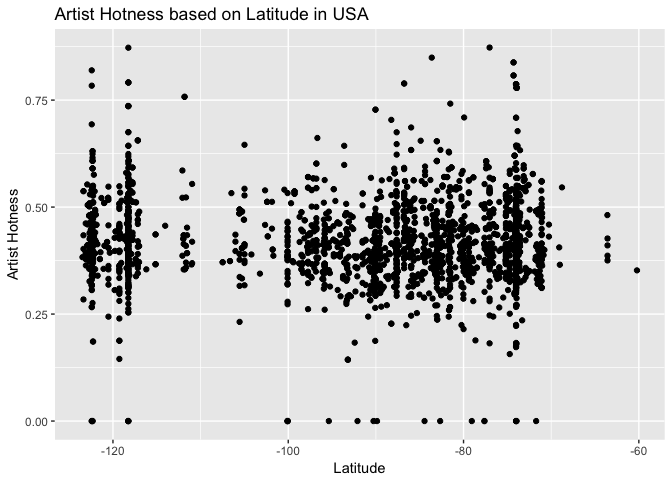

hw05
================
Peter Whitman
10/19/2017

``` r
library(gapminder)
library(singer)
library(knitr)
library(tidyverse)
```

    ## Loading tidyverse: ggplot2
    ## Loading tidyverse: tibble
    ## Loading tidyverse: tidyr
    ## Loading tidyverse: readr
    ## Loading tidyverse: purrr
    ## Loading tidyverse: dplyr

    ## Conflicts with tidy packages ----------------------------------------------

    ## filter(): dplyr, stats
    ## lag():    dplyr, stats

``` r
library(reshape2)
```

    ## 
    ## Attaching package: 'reshape2'

    ## The following object is masked from 'package:tidyr':
    ## 
    ##     smiths

``` r
library(devtools)
library(readxl)
library(tidyr)
library(forcats)
library(ggmap)
library(RColorBrewer)
```

Factor Management
-----------------

-   Define factor variables

``` r
data("singer_locations")
glimpse(singer_locations)
```

    ## Observations: 10,100
    ## Variables: 14
    ## $ track_id           <chr> "TRWICRA128F42368DB", "TRXJANY128F42246FC",...
    ## $ title              <chr> "The Conversation (Cd)", "Lonely Island", "...
    ## $ song_id            <chr> "SOSURTI12A81C22FB8", "SODESQP12A6D4F98EF",...
    ## $ release            <chr> "Even If It Kills Me", "The Duke Of Earl", ...
    ## $ artist_id          <chr> "ARACDPV1187FB58DF4", "ARYBUAO1187FB3F4EB",...
    ## $ artist_name        <chr> "Motion City Soundtrack", "Gene Chandler", ...
    ## $ year               <int> 2007, 2004, 1998, 1995, 1968, 2006, 2003, 2...
    ## $ duration           <dbl> 170.4485, 106.5530, 527.5947, 695.1179, 237...
    ## $ artist_hotttnesss  <dbl> 0.6410183, 0.3937627, 0.4306226, 0.3622792,...
    ## $ artist_familiarity <dbl> 0.8230522, 0.5700167, 0.5039940, 0.4773099,...
    ## $ latitude           <dbl> NA, 41.88415, 40.71455, NA, 42.33168, 40.99...
    ## $ longitude          <dbl> NA, -87.63241, -74.00712, NA, -83.04792, -7...
    ## $ name               <chr> NA, "Gene Chandler", "Paul Horn", NA, "Doro...
    ## $ city               <chr> NA, "Chicago, IL", "New York, NY", NA, "Det...

``` r
release_fac <- singer_locations %>% 
  transform(release = factor(release))
glimpse(release_fac$release)
```

    ##  Factor w/ 9049 levels "! Ich Kann","¡Esta!",..: 2355 7424 3531 6855 365 6514 2306 6739 4328 6272 ...

``` r
fct_count(release_fac$release)
```

    ## # A tibble: 9,049 x 2
    ##                               f     n
    ##                          <fctr> <int>
    ##  1                   ! Ich Kann     1
    ##  2                       ¡Esta!     1
    ##  3                      ¡GRRRR!     1
    ##  4                 ¡Nueva York!     1
    ##  5              ¿Como Te Llama?     1
    ##  6            ¿Hay Alguien Ahí?     1
    ##  7           ... And I Mean It!     1
    ##  8             ...All This Time     2
    ##  9 ...An Education In Rebellion     1
    ## 10         ...Anywhere But Here     1
    ## # ... with 9,039 more rows

``` r
duration_length <- c("long", "short")
as.factor(duration_length)
```

    ## [1] long  short
    ## Levels: long short

``` r
as_factor(duration_length)
```

    ## [1] long  short
    ## Levels: long short

``` r
factor(duration_length)
```

    ## [1] long  short
    ## Levels: long short

-   Drop factor / levels

``` r
dim(release_fac)
```

    ## [1] 10100    14

``` r
nlevels(release_fac$release)
```

    ## [1] 9049

``` r
release_drop <- release_fac %>%
  filter(year != 0) %>%
  droplevels()
dim(release_drop)
```

    ## [1] 10000    14

``` r
nlevels(release_drop$release)
```

    ## [1] 8956

-   Reorder levels based on knowledge from data.

``` r
reorder <- levels(fct_reorder(release_drop$release, release_drop$artist_familiarity, max,desc = FALSE))
head(reorder)
```

    ## [1] "Captain Capa - Tonight is the Constant"
    ## [2] "Diario Mali"                           
    ## [3] "DJ Sneak - Back In The Box"            
    ## [4] "Edge of Incision"                      
    ## [5] "Neues Vom Wixxer"                      
    ## [6] "Smash It Up!"

``` r
arrange1 <- release_drop %>%
  filter(year >= 1995 & city == "Minneapolis, MN") %>%
  arrange(artist_familiarity) %>% 
  ggplot(aes(release, artist_familiarity)) + geom_col() + theme(axis.text.x = element_text(angle = 45, hjust = 1)) + labs(title = "Album Releases in Minneapolis by Artist Familiarity (1995 - Present)", x = "Album Title", y = "Artist Familiarity")
arrange1
```


``` r
arrange2 <- release_drop %>% 
  filter(year >= 1995 & city == "Minneapolis, MN") %>%
  ggplot(aes(x=fct_reorder(release, artist_familiarity, max,desc = FALSE), y=artist_familiarity)) + geom_col() + theme(axis.text.x = element_text(angle = 45, hjust = 1)) + labs(title = "Album Releases in Minneapolis by Artist Familiarity (1995 - Present)", y = "Artist Familiarity", x = "Album Title")
arrange2
```


``` r
arrange3 <- release_drop %>% 
  arrange(artist_familiarity) %>%
  filter(year >= 1995 & city == "Minneapolis, MN") %>%
  ggplot(aes(fct_reorder(release, artist_familiarity, max,desc = FALSE), artist_familiarity)) + geom_col() + scale_x_discrete("release") + theme(axis.text.x = element_text(angle = 45, hjust = 1)) + labs(title = "Album Releases in Minneapolis by Artist Familiarity (1995 - Present)", y = "Artist Familiarity", x = "Album Title")
arrange3
```


File I/O
--------

``` r
ForCSV <- release_drop %>%
  filter(year == 1995) %>%
  group_by(artist_name) %>%
  select(release, artist_name, artist_hotttnesss) %>%
  summarise(hotness = mean(artist_hotttnesss)) %>%
  arrange(desc(hotness)) %>%
  head(10)
write_csv(ForCSV,"ForCSV.csv")
read_csv("ForCSV.csv")
```

    ## Parsed with column specification:
    ## cols(
    ##   artist_name = col_character(),
    ##   hotness = col_double()
    ## )

    ## # A tibble: 10 x 2
    ##                 artist_name   hotness
    ##                       <chr>     <dbl>
    ##  1                   Weezer 0.7761677
    ##  2               Toby Keith 0.6883817
    ##  3    The Smashing Pumpkins 0.6748343
    ##  4               Faith Hill 0.6701062
    ##  5                Third Day 0.6420424
    ##  6          The Temptations 0.6333537
    ##  7             Kenny Rogers 0.6254284
    ##  8            Mary J. Blige 0.6141403
    ##  9 Rage Against The Machine 0.5890868
    ## 10               Supergrass 0.5858614

``` r
saveRDS(ForCSV,"ForCSV.rds")
readRDS("ForCSV.rds")
```

    ## # A tibble: 10 x 2
    ##                 artist_name   hotness
    ##                       <chr>     <dbl>
    ##  1                   Weezer 0.7761677
    ##  2               Toby Keith 0.6883817
    ##  3    The Smashing Pumpkins 0.6748343
    ##  4               Faith Hill 0.6701062
    ##  5                Third Day 0.6420424
    ##  6          The Temptations 0.6333537
    ##  7             Kenny Rogers 0.6254284
    ##  8            Mary J. Blige 0.6141403
    ##  9 Rage Against The Machine 0.5890868
    ## 10               Supergrass 0.5858614

``` r
dput(ForCSV,"ForCSV.txt")
dget("ForCSV.txt")
```

    ## # A tibble: 10 x 2
    ##                 artist_name   hotness
    ##                       <chr>     <dbl>
    ##  1                   Weezer 0.7761677
    ##  2               Toby Keith 0.6883817
    ##  3    The Smashing Pumpkins 0.6748343
    ##  4               Faith Hill 0.6701062
    ##  5                Third Day 0.6420424
    ##  6          The Temptations 0.6333537
    ##  7             Kenny Rogers 0.6254284
    ##  8            Mary J. Blige 0.6141403
    ##  9 Rage Against The Machine 0.5890868
    ## 10               Supergrass 0.5858614

Visualization Design
--------------------

``` r
viz <- singer_locations %>% 
  filter(!is.na(latitude)) %>%
  mutate(north_south=c("north", "south")[(latitude>39.43) + 1]) %>%
  filter(artist_hotttnesss != 0) %>%
  ggplot(aes(artist_hotttnesss, artist_familiarity, color = north_south)) + geom_point(alpha = .2)
viz
```


``` r
viz2 <- singer_locations %>% 
  filter(!is.na(latitude)) %>%
  filter(latitude > 25 & latitude <= 49 & longitude < -50 & longitude > -150) %>%
  filter(artist_hotttnesss != 0) %>%
  ggplot(aes(artist_hotttnesss, artist_familiarity, color = latitude)) + 
  geom_point() +
  scale_colour_gradient2(low = "red", mid = "white", high = "blue", midpoint = 39.43, "Latitude") + 
  labs(title="Artist Hotness vs. Artist Familiarity Based on Latitude in USA", x = "Artist Hotness", y = "Artist Familiarity") 
viz2 
```


``` r
singer_locations %>%
  filter(latitude > 25 & latitude <= 49 & longitude < -50 & longitude > -150) %>%
  ggplot(aes(longitude, artist_hotttnesss)) + 
  geom_point() +
  labs(title="Artist Hotness based on Latitude in USA", x = "Latitude", y = "Artist Hotness") 
```



``` r
singer_locations %>%
  filter(latitude > 25 & latitude <= 49 & longitude < -50 & longitude > -150) %>%
  ggplot(aes(longitude, latitude, color = artist_hotttnesss)) + 
  geom_point()
```


``` r
map <- get_googlemap(center = c(long = -97, lat = 39.8283), zoom = 4, size = c(640,640), scale = 2)
```

    ## Map from URL : http://maps.googleapis.com/maps/api/staticmap?center=39.8283,-97&zoom=4&size=640x640&scale=2&maptype=terrain&sensor=false

``` r
ggmap(map, fullpage = TRUE) + 
  geom_point(data=singer_locations, 
             aes(longitude, latitude, color = artist_hotttnesss)) +
  labs(title="Artist Hotness within the United States") +
  scale_colour_distiller(palette="Oranges", "Artist Hotness", direction = 1)
```

    ## Warning: fullpage and expand syntaxes deprecated, use extent.

    ## Warning: `panel.margin` is deprecated. Please use `panel.spacing` property
    ## instead

    ## Warning: Removed 7514 rows containing missing values (geom_point).


``` r
mapWorld <- borders("world", colour="gray50", fill="gray50")
```

    ## 
    ## Attaching package: 'maps'

    ## The following object is masked from 'package:purrr':
    ## 
    ##     map

``` r
mp <- ggplot() + 
  mapWorld + 
  geom_point(data=singer_locations, 
             aes(longitude, latitude), colour="Deep Pink", 
             fill="Pink",pch=21, size=1, alpha=I(0.7)) +
  labs(x="Longitude", y="Latitude", title="World Map of Artist Locations")
mp 
```

    ## Warning: Removed 5968 rows containing missing values (geom_point).


``` r
a <- singer_locations %>%
  filter(!is.na(latitude)) %>%
  filter(latitude > 25 & latitude <= 49 & longitude < -50 & longitude > -150) %>%
  ggplot(aes(longitude, latitude)) + stat_density_2d(aes(fill = ..level..), geom = "polygon") + geom_point() + coord_map() 
a
```


``` r
usa <- map_data("usa")
POI <- singer_locations %>%
  filter(!is.na(latitude)) %>%
  filter(latitude > 25 & latitude <= 49 & longitude < -50 & longitude > -150)
densitymap <- ggplot(data = usa) + 
  geom_polygon(aes(x = long, y = lat, group = group, color = "grey"), color = "white") +  
  coord_fixed(1.3) +
  guides(fill=FALSE) +
  ##geom_point(data = POI, aes(longitude, latitude), color = "pink", alpha = 0.2) +
  stat_density_2d(data = POI, aes(longitude, latitude, color = ..level..), geom = "polygon", alpha = 0.4) + scale_colour_distiller(palette="Spectral", "Density") +
  labs(x="Longitude", y="Latitude", title="Artist Density in the United States") 
densitymap
```


Writing Figures to Files
------------------------

``` r
ggsave("USA_ArtistDensity.pdf", width=15, height=10, units="cm", plot = densitymap)
ggsave("ArtistDistribution.png", width=15, height=10, units="cm", plot = mp)
```

    ## Warning: Removed 5968 rows containing missing values (geom_point).

Clean up your repo!
-------------------
