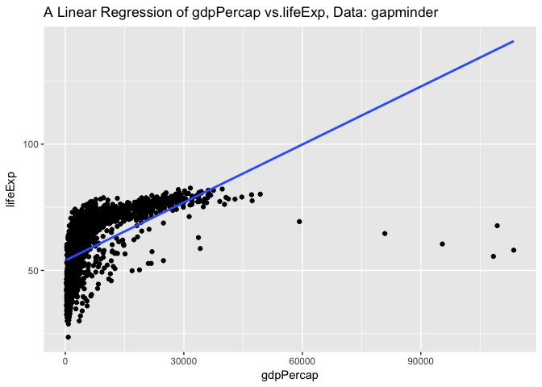
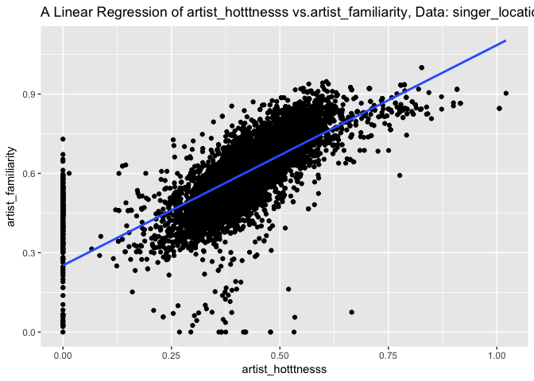
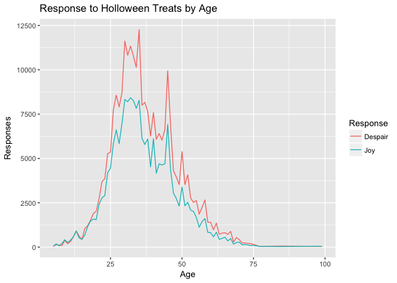
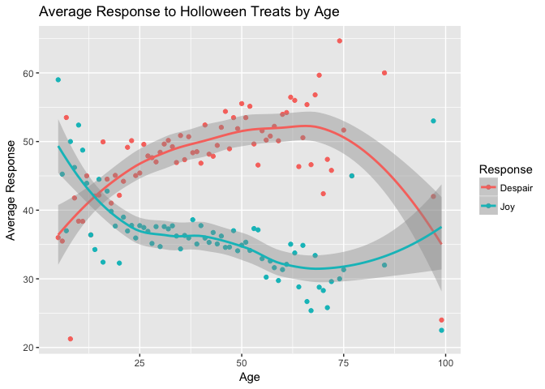
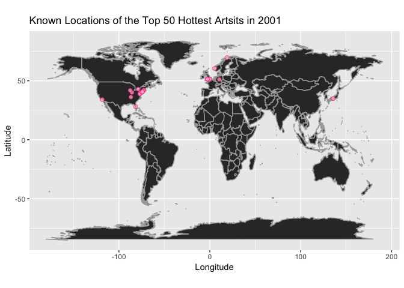
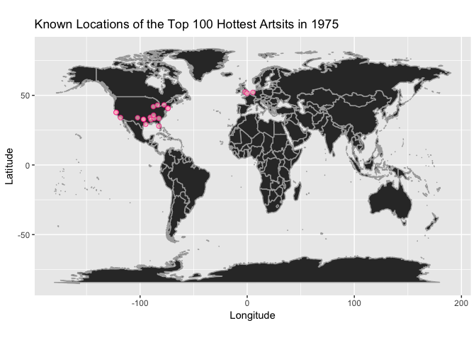
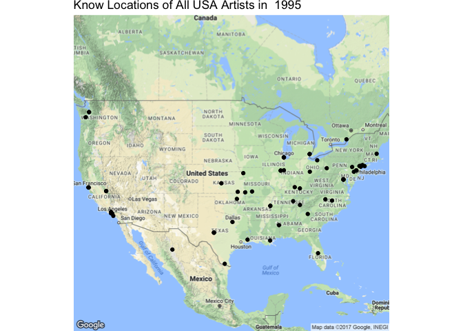
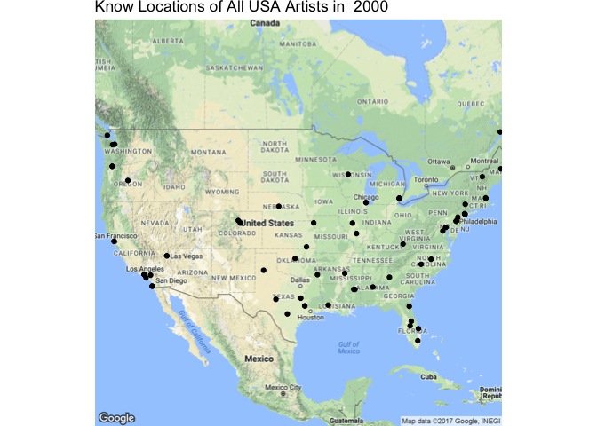

Homework 06 - Data Wrangling Wrap Up
================
Peter Whitman
11/3/2017

``` r
library(gapminder)
library(readr)
library(singer)
library(knitr)
library(tidyverse)
```

    ## Loading tidyverse: ggplot2
    ## Loading tidyverse: tibble
    ## Loading tidyverse: tidyr
    ## Loading tidyverse: purrr
    ## Loading tidyverse: dplyr

    ## Warning: package 'purrr' was built under R version 3.4.2

    ## Conflicts with tidy packages ----------------------------------------------

    ## filter(): dplyr, stats
    ## lag():    dplyr, stats

``` r
library(reshape2)
```

    ## 
    ## Attaching package: 'reshape2'

    ## The following object is masked from 'package:tidyr':
    ## 
    ##     smiths

``` r
library(devtools)
library(readxl)
library(tidyr)
library(forcats)
library(ggmap)
library(RColorBrewer)
library(repurrrsive)
library(listviewer)
library(jsonlite)
```

    ## 
    ## Attaching package: 'jsonlite'

    ## The following object is masked from 'package:purrr':
    ## 
    ##     flatten

``` r
library(dplyr)
library(tibble)
library(purrr)
data("singer_locations")
```

Writing functions
=================

*I would like to create a function that returns the top specified number of hottest artists in a chosen year. First, I need to know that range of years present in the dataset so I can prompt the user in the right direction if they have inputed a year outside of the range.*

``` r
max(singer_locations$year)
```

    ## [1] 2010

``` r
min(singer_locations$year)
```

    ## [1] 0

*When analyzing the singer\_locations dataset, this function will except a year and a specified number of artists as arguments. The function will output the top specified number of hottest artists in that year. I've included two if statements to get the user back on track if they try to input an argument that is outside of the scope of the function. Notice that there are duplicate entries...I'm not sure why that is*

``` r
HottestArtists <- function(x, y) 
{
  if(!is.numeric(x))
  {
    stop('I am so sorry, but this function only works for numeric input!\n',
         'You have provided an object of class: ', class(x)[1])
  }
  if(x > 2010 | x < 1950)
  {
    stop('You must enter a year between 1950 and 2010', default = NULL)
  }
  artists1 <- singer_locations %>%
  filter(year == x) %>%
  select(release, artist_name, artist_hotttnesss, latitude, longitude, city)
  
  artists2 <- singer_locations %>%
  filter(year == x) %>%
  group_by(artist_name) %>%
  summarize(hotness = mean(artist_hotttnesss)) %>%
  arrange(desc(hotness)) %>%
  head(y)
  
  artists3 <- semi_join(artists1, artists2, by = "artist_name")
  return(artists3)
}
HottestArtists(1995, 50)
```

    ## # A tibble: 54 x 6
    ##                                                   release     artist_name
    ##                                                     <chr>           <chr>
    ##  1                                  Destroy Erase Improve       Meshuggah
    ##  2               Grand Prix / Songs From Northern Britain Teenage Fanclub
    ##  3 Still The Orchestra Plays - Greatest Hits Volume 1 & 2        Savatage
    ##  4                                              Third Day       Third Day
    ##  5                                         Blonde Redhead  Blonde Redhead
    ##  6                                              Mr. Smith       LL Cool J
    ##  7                     Black Sunday / III Temples Of Boom    Cypress Hill
    ##  8                             Toby Keith 35 Biggest Hits      Toby Keith
    ##  9                                       It Matters To Me      Faith Hill
    ## 10                                          Said And Done         Boyzone
    ## # ... with 44 more rows, and 4 more variables: artist_hotttnesss <dbl>,
    ## #   latitude <dbl>, longitude <dbl>, city <chr>

``` r
HottestArtists(2005, 20)
```

    ## # A tibble: 23 x 6
    ##                        release
    ##                          <chr>
    ##  1               Devils & Dust
    ##  2          All That We Needed
    ##  3 Jagged Little Pill Acoustic
    ##  4    The Emancipation of Mimi
    ##  5       Don't Forget About Us
    ##  6                The Triptych
    ##  7 Dance Vault Remixes - Diary
    ##  8       When Everything Falls
    ##  9           Caught In The Act
    ## 10       Don't Forget About Us
    ## # ... with 13 more rows, and 5 more variables: artist_name <chr>,
    ## #   artist_hotttnesss <dbl>, latitude <dbl>, longitude <dbl>, city <chr>

*I know the homework prompt asked for functions that go beyond simple dplyr verbs. So, I've created a function that excepts a dataframe, and two variables as arguments. The output is a summary of a linear regression for the two specified variables and the corresponding plot. I spent a little time trying to figure out how to develop plot and axis titles that changed with the arguments*

``` r
easylm <- function(data, x, y) 
{
      avectorx <- data[ , x]
      avectory <- data[ , y]
      formula <- paste(x, y, sep = "~")
      result <- lm(formula, data)
      summary <- summary(result)
      chart_title <- substitute(paste("A Linear Regression of ", x," vs.", y, ", Data: ", data))
      plot <- ggplot(data = data, aes(x = avectorx, y = avectory)) + geom_point() + geom_smooth(method = "lm", se = FALSE) + ggtitle(chart_title) + labs(x = x, y = y)
      return(list(summary, plot))
}
easylm(data = gapminder, x = "gdpPercap", y = "lifeExp")
```

    ## [[1]]
    ## 
    ## Call:
    ## lm(formula = formula, data = data)
    ## 
    ## Residuals:
    ##    Min     1Q Median     3Q    Max 
    ## -11483  -4539  -1223   2482 106950 
    ## 
    ## Coefficients:
    ##              Estimate Std. Error t value Pr(>|t|)    
    ## (Intercept) -19277.25     914.09  -21.09   <2e-16 ***
    ## lifeExp        445.44      15.02   29.66   <2e-16 ***
    ## ---
    ## Signif. codes:  0 '***' 0.001 '**' 0.01 '*' 0.05 '.' 0.1 ' ' 1
    ## 
    ## Residual standard error: 8006 on 1702 degrees of freedom
    ## Multiple R-squared:  0.3407, Adjusted R-squared:  0.3403 
    ## F-statistic: 879.6 on 1 and 1702 DF,  p-value: < 2.2e-16
    ## 
    ## 
    ## [[2]]

    ## Don't know how to automatically pick scale for object of type tbl_df/tbl/data.frame. Defaulting to continuous.
    ## Don't know how to automatically pick scale for object of type tbl_df/tbl/data.frame. Defaulting to continuous.



*Below, I've tested the easylm() function on the singer\_locations dataset*

``` r
easylm(data = singer_locations, x = "artist_hotttnesss", y = "artist_familiarity")
```

    ## [[1]]
    ## 
    ## Call:
    ## lm(formula = formula, data = data)
    ## 
    ## Residuals:
    ##      Min       1Q   Median       3Q      Max 
    ## -0.49916 -0.03089  0.00115  0.03405  0.58423 
    ## 
    ## Coefficients:
    ##                    Estimate Std. Error t value Pr(>|t|)    
    ## (Intercept)        0.033379   0.003641   9.166   <2e-16 ***
    ## artist_familiarity 0.638470   0.005963 107.079   <2e-16 ***
    ## ---
    ## Signif. codes:  0 '***' 0.001 '**' 0.01 '*' 0.05 '.' 0.1 ' ' 1
    ## 
    ## Residual standard error: 0.07548 on 10098 degrees of freedom
    ## Multiple R-squared:  0.5317, Adjusted R-squared:  0.5317 
    ## F-statistic: 1.147e+04 on 1 and 10098 DF,  p-value: < 2.2e-16
    ## 
    ## 
    ## [[2]]

    ## Don't know how to automatically pick scale for object of type tbl_df/tbl/data.frame. Defaulting to continuous.
    ## Don't know how to automatically pick scale for object of type tbl_df/tbl/data.frame. Defaulting to continuous.



*One last function (for now). I've created a simple correlation function which compares all of the numeric variables in a dataset*

``` r
correlation <- function(data) 
{
  cor(data[,unlist(lapply(data, is.numeric))])    
}
correlation(gapminder)
```

    ##                 year    lifeExp         pop   gdpPercap
    ## year      1.00000000 0.43561122  0.08230808  0.22731807
    ## lifeExp   0.43561122 1.00000000  0.06495537  0.58370622
    ## pop       0.08230808 0.06495537  1.00000000 -0.02559958
    ## gdpPercap 0.22731807 0.58370622 -0.02559958  1.00000000

``` r
correlation(singer_locations)
```

    ##                           year    duration artist_hotttnesss
    ## year               1.000000000 0.009993933       0.082448603
    ## duration           0.009993933 1.000000000       0.004459204
    ## artist_hotttnesss  0.082448603 0.004459204       1.000000000
    ## artist_familiarity 0.074097944 0.001740810       0.729190144
    ## latitude                    NA          NA                NA
    ## longitude                   NA          NA                NA
    ##                    artist_familiarity latitude longitude
    ## year                       0.07409794       NA        NA
    ## duration                   0.00174081       NA        NA
    ## artist_hotttnesss          0.72919014       NA        NA
    ## artist_familiarity         1.00000000       NA        NA
    ## latitude                           NA        1        NA
    ## longitude                          NA       NA         1

Work with the candy data
========================

*Below I've examined how joy/despair scores change with age. First I had to download the dataset from github, and read the resulting .csv into a dataframe. I then worked on trying to find the sum of joy and despair responses for each row using rowSums(). Finally, I grouped the results by age, summarized the counts of joy and despair, and melted the dataframe for plotting purposes.*

``` r
candy <- read.csv("candydata.csv", stringsAsFactors = FALSE)
candy_id <- candy %>%
  select(age = starts_with("How"), everything()) 
sums <- candy_id %>%
  mutate(joysum = rowSums(candy_id=="JOY"), despairsum = rowSums(candy_id=="DESPAIR")) 
total <- sums %>%
  select(age, despairsum, joysum) %>%
  group_by(age) %>%
  summarize(sum(despairsum), sum(joysum)) %>%
  filter(age != 44.4444)
total
```

    ## # A tibble: 74 x 3
    ##      age `sum(despairsum)` `sum(joysum)`
    ##    <dbl>             <dbl>         <dbl>
    ##  1     5                36            59
    ##  2     6               142           181
    ##  3     7               107            74
    ##  4     8                85           200
    ##  5     9               376           416
    ##  6    10               192           262
    ##  7    11               307           390
    ##  8    12               585           571
    ##  9    13               910           910
    ## 10    14               631           514
    ## # ... with 64 more rows

``` r
total2 <- melt(total, id.vars = "age")
total2
```

    ##     age        variable value
    ## 1     5 sum(despairsum)    36
    ## 2     6 sum(despairsum)   142
    ## 3     7 sum(despairsum)   107
    ## 4     8 sum(despairsum)    85
    ## 5     9 sum(despairsum)   376
    ## 6    10 sum(despairsum)   192
    ## 7    11 sum(despairsum)   307
    ## 8    12 sum(despairsum)   585
    ## 9    13 sum(despairsum)   910
    ## 10   14 sum(despairsum)   631
    ## 11   15 sum(despairsum)   422
    ## 12   16 sum(despairsum)  1049
    ## 13   17 sum(despairsum)  1202
    ## 14   18 sum(despairsum)  1518
    ## 15   19 sum(despairsum)  1893
    ## 16   20 sum(despairsum)  2024
    ## 17   21 sum(despairsum)  2741
    ## 18   22 sum(despairsum)  3687
    ## 19   23 sum(despairsum)  3860
    ## 20   24 sum(despairsum)  5270
    ## 21   25 sum(despairsum)  5359
    ## 22   26 sum(despairsum)  7736
    ## 23   27 sum(despairsum)  8574
    ## 24   28 sum(despairsum)  7910
    ## 25   29 sum(despairsum)  8701
    ## 26   30 sum(despairsum) 11625
    ## 27   31 sum(despairsum) 10821
    ## 28   32 sum(despairsum) 11337
    ## 29   33 sum(despairsum) 10786
    ## 30   34 sum(despairsum) 10140
    ## 31   35 sum(despairsum) 12261
    ## 32   36 sum(despairsum)  8004
    ## 33   37 sum(despairsum)  8163
    ## 34   38 sum(despairsum)  7643
    ## 35   39 sum(despairsum)  6259
    ## 36   40 sum(despairsum)  7589
    ## 37   41 sum(despairsum)  6080
    ## 38   42 sum(despairsum)  6405
    ## 39   43 sum(despairsum)  6030
    ## 40   44 sum(despairsum)  6625
    ## 41   45 sum(despairsum)  9945
    ## 42   46 sum(despairsum)  6853
    ## 43   47 sum(despairsum)  4307
    ## 44   48 sum(despairsum)  3958
    ## 45   49 sum(despairsum)  3528
    ## 46   50 sum(despairsum)  5386
    ## 47   51 sum(despairsum)  3530
    ## 48   52 sum(despairsum)  4080
    ## 49   53 sum(despairsum)  2780
    ## 50   54 sum(despairsum)  2515
    ## 51   55 sum(despairsum)  2630
    ## 52   56 sum(despairsum)  1858
    ## 53   57 sum(despairsum)  2235
    ## 54   58 sum(despairsum)  2663
    ## 55   59 sum(despairsum)  1403
    ## 56   60 sum(despairsum)  1403
    ## 57   61 sum(despairsum)   976
    ## 58   62 sum(despairsum)  1355
    ## 59   63 sum(despairsum)   728
    ## 60   64 sum(despairsum)   788
    ## 61   65 sum(despairsum)   809
    ## 62   66 sum(despairsum)   720
    ## 63   67 sum(despairsum)   886
    ## 64   68 sum(despairsum)   284
    ## 65   69 sum(despairsum)   537
    ## 66   70 sum(despairsum)   424
    ## 67   71 sum(despairsum)   237
    ## 68   72 sum(despairsum)   229
    ## 69   74 sum(despairsum)   194
    ## 70   75 sum(despairsum)   155
    ## 71   77 sum(despairsum)    45
    ## 72   85 sum(despairsum)    60
    ## 73   97 sum(despairsum)    42
    ## 74   99 sum(despairsum)    48
    ## 75    5     sum(joysum)    59
    ## 76    6     sum(joysum)   181
    ## 77    7     sum(joysum)    74
    ## 78    8     sum(joysum)   200
    ## 79    9     sum(joysum)   416
    ## 80   10     sum(joysum)   262
    ## 81   11     sum(joysum)   390
    ## 82   12     sum(joysum)   571
    ## 83   13     sum(joysum)   910
    ## 84   14     sum(joysum)   514
    ## 85   15     sum(joysum)   445
    ## 86   16     sum(joysum)   681
    ## 87   17     sum(joysum)  1155
    ## 88   18     sum(joysum)  1474
    ## 89   19     sum(joysum)  1583
    ## 90   20     sum(joysum)  1550
    ## 91   21     sum(joysum)  2417
    ## 92   22     sum(joysum)  2773
    ## 93   23     sum(joysum)  2909
    ## 94   24     sum(joysum)  4206
    ## 95   25     sum(joysum)  4454
    ## 96   26     sum(joysum)  5846
    ## 97   27     sum(joysum)  6607
    ## 98   28     sum(joysum)  5835
    ## 99   29     sum(joysum)  6957
    ## 100  30     sum(joysum)  8327
    ## 101  31     sum(joysum)  8199
    ## 102  32     sum(joysum)  8424
    ## 103  33     sum(joysum)  8261
    ## 104  34     sum(joysum)  7827
    ## 105  35     sum(joysum)  8281
    ## 106  36     sum(joysum)  6138
    ## 107  37     sum(joysum)  5788
    ## 108  38     sum(joysum)  6100
    ## 109  39     sum(joysum)  4524
    ## 110  40     sum(joysum)  6116
    ## 111  41     sum(joysum)  4169
    ## 112  42     sum(joysum)  4696
    ## 113  43     sum(joysum)  4630
    ## 114  44     sum(joysum)  4701
    ## 115  45     sum(joysum)  6920
    ## 116  46     sum(joysum)  4357
    ## 117  47     sum(joysum)  3047
    ## 118  48     sum(joysum)  2739
    ## 119  49     sum(joysum)  2318
    ## 120  50     sum(joysum)  3386
    ## 121  51     sum(joysum)  2332
    ## 122  52     sum(joysum)  2526
    ## 123  53     sum(joysum)  2090
    ## 124  54     sum(joysum)  2005
    ## 125  55     sum(joysum)  1680
    ## 126  56     sum(joysum)  1119
    ## 127  57     sum(joysum)  1434
    ## 128  58     sum(joysum)  1613
    ## 129  59     sum(joysum)   833
    ## 130  60     sum(joysum)   815
    ## 131  61     sum(joysum)   578
    ## 132  62     sum(joysum)   841
    ## 133  63     sum(joysum)   439
    ## 134  64     sum(joysum)   490
    ## 135  65     sum(joysum)   558
    ## 136  66     sum(joysum)   347
    ## 137  67     sum(joysum)   482
    ## 138  68     sum(joysum)   167
    ## 139  69     sum(joysum)   259
    ## 140  70     sum(joysum)   283
    ## 141  71     sum(joysum)   129
    ## 142  72     sum(joysum)   148
    ## 143  74     sum(joysum)    90
    ## 144  75     sum(joysum)    94
    ## 145  77     sum(joysum)    45
    ## 146  85     sum(joysum)    32
    ## 147  97     sum(joysum)    53
    ## 148  99     sum(joysum)    45

``` r
total2 %>% ggplot(aes(age, value, color = variable)) + geom_line() + scale_color_discrete(name = "Response", labels = c("Despair", "Joy")) + labs(title = "Response to Holloween Treats by Age", x = "Age", y = "Responses")
```



*Its quite clear that far more middle-aged individuals responded to the survey than children or senior citizens, so to get a better idea of how each age responds to holloween treats, I found the mean number of joy and despair responses per age and plotted the result.*

``` r
mean <- sums %>%
  select(age, despairsum, joysum) %>%
  group_by(age) %>%
  summarize(mean(despairsum), mean(joysum)) %>%
  filter(age != 44.4444) 
mean2 <- melt(mean, id.vars = "age")
mean2
```

    ##     age         variable    value
    ## 1     5 mean(despairsum) 36.00000
    ## 2     6 mean(despairsum) 35.50000
    ## 3     7 mean(despairsum) 53.50000
    ## 4     8 mean(despairsum) 21.25000
    ## 5     9 mean(despairsum) 41.77778
    ## 6    10 mean(despairsum) 38.40000
    ## 7    11 mean(despairsum) 38.37500
    ## 8    12 mean(despairsum) 45.00000
    ## 9    13 mean(despairsum) 36.40000
    ## 10   14 mean(despairsum) 42.06667
    ## 11   15 mean(despairsum) 42.20000
    ## 12   16 mean(despairsum) 49.95238
    ## 13   17 mean(despairsum) 44.51852
    ## 14   18 mean(despairsum) 41.02703
    ## 15   19 mean(despairsum) 45.07143
    ## 16   20 mean(despairsum) 42.16667
    ## 17   21 mean(despairsum) 44.20968
    ## 18   22 mean(despairsum) 49.16000
    ## 19   23 mean(despairsum) 50.12987
    ## 20   24 mean(despairsum) 45.04274
    ## 21   25 mean(despairsum) 45.41525
    ## 22   26 mean(despairsum) 49.58974
    ## 23   27 mean(despairsum) 47.89944
    ## 24   28 mean(despairsum) 47.65060
    ## 25   29 mean(despairsum) 47.03243
    ## 26   30 mean(despairsum) 48.43750
    ## 27   31 mean(despairsum) 49.63761
    ## 28   32 mean(despairsum) 50.16372
    ## 29   33 mean(despairsum) 49.25114
    ## 30   34 mean(despairsum) 46.94444
    ## 31   35 mean(despairsum) 50.87552
    ## 32   36 mean(despairsum) 47.36095
    ## 33   37 mean(despairsum) 50.70186
    ## 34   38 mean(despairsum) 48.37342
    ## 35   39 mean(despairsum) 48.51938
    ## 36   40 mean(despairsum) 46.84568
    ## 37   41 mean(despairsum) 52.41379
    ## 38   42 mean(despairsum) 48.15789
    ## 39   43 mean(despairsum) 47.85714
    ## 40   44 mean(despairsum) 49.44030
    ## 41   45 mean(despairsum) 52.06806
    ## 42   46 mean(despairsum) 54.38889
    ## 43   47 mean(despairsum) 48.94318
    ## 44   48 mean(despairsum) 53.48649
    ## 45   49 mean(despairsum) 51.88235
    ## 46   50 mean(despairsum) 55.52577
    ## 47   51 mean(despairsum) 53.48485
    ## 48   52 mean(despairsum) 55.13514
    ## 49   53 mean(despairsum) 49.64286
    ## 50   54 mean(despairsum) 46.57407
    ## 51   55 mean(despairsum) 51.56863
    ## 52   56 mean(despairsum) 50.21622
    ## 53   57 mean(despairsum) 50.79545
    ## 54   58 mean(despairsum) 52.21569
    ## 55   59 mean(despairsum) 50.10714
    ## 56   60 mean(despairsum) 53.96154
    ## 57   61 mean(despairsum) 54.22222
    ## 58   62 mean(despairsum) 56.45833
    ## 59   63 mean(despairsum) 56.00000
    ## 60   64 mean(despairsum) 46.35294
    ## 61   65 mean(despairsum) 50.56250
    ## 62   66 mean(despairsum) 55.38462
    ## 63   67 mean(despairsum) 46.63158
    ## 64   68 mean(despairsum) 56.80000
    ## 65   69 mean(despairsum) 59.66667
    ## 66   70 mean(despairsum) 42.40000
    ## 67   71 mean(despairsum) 47.40000
    ## 68   72 mean(despairsum) 45.80000
    ## 69   74 mean(despairsum) 64.66667
    ## 70   75 mean(despairsum) 51.66667
    ## 71   77 mean(despairsum) 45.00000
    ## 72   85 mean(despairsum) 60.00000
    ## 73   97 mean(despairsum) 42.00000
    ## 74   99 mean(despairsum) 24.00000
    ## 75    5     mean(joysum) 59.00000
    ## 76    6     mean(joysum) 45.25000
    ## 77    7     mean(joysum) 37.00000
    ## 78    8     mean(joysum) 50.00000
    ## 79    9     mean(joysum) 46.22222
    ## 80   10     mean(joysum) 52.40000
    ## 81   11     mean(joysum) 48.75000
    ## 82   12     mean(joysum) 43.92308
    ## 83   13     mean(joysum) 36.40000
    ## 84   14     mean(joysum) 34.26667
    ## 85   15     mean(joysum) 44.50000
    ## 86   16     mean(joysum) 32.42857
    ## 87   17     mean(joysum) 42.77778
    ## 88   18     mean(joysum) 39.83784
    ## 89   19     mean(joysum) 37.69048
    ## 90   20     mean(joysum) 32.29167
    ## 91   21     mean(joysum) 38.98387
    ## 92   22     mean(joysum) 36.97333
    ## 93   23     mean(joysum) 37.77922
    ## 94   24     mean(joysum) 35.94872
    ## 95   25     mean(joysum) 37.74576
    ## 96   26     mean(joysum) 37.47436
    ## 97   27     mean(joysum) 36.91061
    ## 98   28     mean(joysum) 35.15060
    ## 99   29     mean(joysum) 37.60541
    ## 100  30     mean(joysum) 34.69583
    ## 101  31     mean(joysum) 37.61009
    ## 102  32     mean(joysum) 37.27434
    ## 103  33     mean(joysum) 37.72146
    ## 104  34     mean(joysum) 36.23611
    ## 105  35     mean(joysum) 34.36100
    ## 106  36     mean(joysum) 36.31953
    ## 107  37     mean(joysum) 35.95031
    ## 108  38     mean(joysum) 38.60759
    ## 109  39     mean(joysum) 35.06977
    ## 110  40     mean(joysum) 37.75309
    ## 111  41     mean(joysum) 35.93966
    ## 112  42     mean(joysum) 35.30827
    ## 113  43     mean(joysum) 36.74603
    ## 114  44     mean(joysum) 35.08209
    ## 115  45     mean(joysum) 36.23037
    ## 116  46     mean(joysum) 34.57937
    ## 117  47     mean(joysum) 34.62500
    ## 118  48     mean(joysum) 37.01351
    ## 119  49     mean(joysum) 34.08824
    ## 120  50     mean(joysum) 34.90722
    ## 121  51     mean(joysum) 35.33333
    ## 122  52     mean(joysum) 34.13514
    ## 123  53     mean(joysum) 37.32143
    ## 124  54     mean(joysum) 37.12963
    ## 125  55     mean(joysum) 32.94118
    ## 126  56     mean(joysum) 30.24324
    ## 127  57     mean(joysum) 32.59091
    ## 128  58     mean(joysum) 31.62745
    ## 129  59     mean(joysum) 29.75000
    ## 130  60     mean(joysum) 31.34615
    ## 131  61     mean(joysum) 32.11111
    ## 132  62     mean(joysum) 35.04167
    ## 133  63     mean(joysum) 33.76923
    ## 134  64     mean(joysum) 28.82353
    ## 135  65     mean(joysum) 34.87500
    ## 136  66     mean(joysum) 26.69231
    ## 137  67     mean(joysum) 25.36842
    ## 138  68     mean(joysum) 33.40000
    ## 139  69     mean(joysum) 28.77778
    ## 140  70     mean(joysum) 28.30000
    ## 141  71     mean(joysum) 25.80000
    ## 142  72     mean(joysum) 29.60000
    ## 143  74     mean(joysum) 30.00000
    ## 144  75     mean(joysum) 31.33333
    ## 145  77     mean(joysum) 45.00000
    ## 146  85     mean(joysum) 32.00000
    ## 147  97     mean(joysum) 53.00000
    ## 148  99     mean(joysum) 22.50000

``` r
mean2 %>% ggplot(aes(age, value, color = variable)) + geom_point() + geom_smooth() + scale_color_discrete(name = "Response", labels = c("Despair", "Joy")) + labs(title = "Average Response to Holloween Treats by Age", x = "Age", y = "Average Response")
```

    ## `geom_smooth()` using method = 'loess'



*You would think that as people get older they would get less picky about holloween treats, but apperently, accordring to the plot above, this is not the case. *

Work with the singer data
=========================

*ggmap isn't the only way to map data, so I tried out a different approach first and then used ggmap later on. For both approaches, I made a function that excepts a year and the number of artists as the argument. It then produces a table and map with the known locations of the top specified number of hottest artists in that year. The table allows users to see that many artists do not have lat/long coordinates. Similar to the easylm function, I created a plot title that changes with the inputed argument*

``` r
TopMapArtist <- function(x, y)
{
if(!is.numeric(x))
  {
    stop('I am so sorry, but this function only works for numeric input!\n',
         'You have provided an object of class: ', class(x)[1])
  }
  if(x > 2010 | x < 1950)
  {
    stop('You must enter a year between 1950 and 2010', default = NULL)
  }
  
world <- map_data("world")
AOI <- HottestArtists(x, y)
POI <- AOI %>% 
  filter(!is.na(latitude))
print(POI)

worldmap_title <- substitute(paste("Known Locations of the Top ", y, " Hottest Artsits in ", x))
  
ggplot(data = world) + 
  geom_polygon(aes(x = long, y = lat, group = group, color = "dark grey"), color = "dark grey") +   coord_fixed(1.3) +
  guides(fill=FALSE) +
  geom_point(data = POI, aes(longitude, latitude), color = "Deep Pink", fill="Pink",pch=21, size=2, alpha=I(0.7)) + ggtitle(worldmap_title) + labs(x="Longitude", y="Latitude") 
}
TopMapArtist(2001, 50)
```

    ## 
    ## Attaching package: 'maps'

    ## The following object is masked from 'package:purrr':
    ## 
    ##     map

    ## # A tibble: 22 x 6
    ##                                                        release
    ##                                                          <chr>
    ##  1                                                      Mutter
    ##  2                                                       Fyuti
    ##  3                                              End Is Forever
    ##  4                                                  Fill Me In
    ##  5                                                    Blowback
    ##  6                          High Noon - 20 All Time Favourites
    ##  7                                               Outrospective
    ##  8                                           Wu-Tang Iron Flag
    ##  9 Moldy Peaches 2000: Unreleased Cutz And Live Jamz 1994-2002
    ## 10                                                           V
    ## # ... with 12 more rows, and 5 more variables: artist_name <chr>,
    ## #   artist_hotttnesss <dbl>, latitude <dbl>, longitude <dbl>, city <chr>



``` r
TopMapArtist(1975, 100)
```

    ## # A tibble: 21 x 6
    ##                             release              artist_name
    ##                               <chr>                    <chr>
    ##  1                   Face The Music Electric Light Orchestra
    ##  2                    Tale Spinnin'           Weather Report
    ##  3                  Still Caught Up           Millie Jackson
    ##  4               Heavy Metal Be-Bop     The Brecker Brothers
    ##  5             Two Bugs And A Roach              Earl Hooker
    ##  6                      In The Slot           Tower Of Power
    ##  7                  Doctor's Orders            Carol Douglas
    ##  8            The Very Best Of Poco                     Poco
    ##  9 Bolan's Zip Gun (Deluxe Edition)                    T.Rex
    ## 10                      The Best Of                   Smokie
    ## # ... with 11 more rows, and 4 more variables: artist_hotttnesss <dbl>,
    ## #   latitude <dbl>, longitude <dbl>, city <chr>



*I created another function that uses ggmap. Similar to previous functions, this function takes a year as an argument, and produces a map with the known locations of all US artists for that chosen year. I played around with filtering based on lat/long coordinates. In this case I filted the data by the lat/long coordinates of the extent of the USA (notice this isn't perfect -- there is a entry from Canada and Mexico).*

``` r
USArtists <- function(x)
{
  if(!is.numeric(x))
  {
    stop('I am so sorry, but this function only works for numeric input!\n',
         'You have provided an object of class: ', class(x)[1])
  }
  if(x > 2010 | x < 1950)
  {
    stop('You must enter a year between 1950 and 2010', default = NULL)
  }
  USArtists1 <- singer_locations %>%
    filter(year == x) %>%
    filter(latitude > 25 & latitude <= 49 & longitude < -50 & longitude > -150) %>%
    select(release, artist_name, artist_hotttnesss, latitude, longitude, city)
  
  first_line <- paste("Know Locations of All USA Artists in ", x)
  #second_line <- paste("USA in ", x)
  
  map2 <- get_googlemap(center = c(long = -97, lat = 39.8283), zoom = 4, size = c(640,640), scale = 2)
  ggmap <- ggmap(map2, fullpage = TRUE) + 
  geom_point(data=USArtists1, aes(longitude, latitude)) + ggtitle(paste0(first_line)) 
  return(list(USArtists1, ggmap))
}
USArtists(1995)
```

    ## Map from URL : http://maps.googleapis.com/maps/api/staticmap?center=39.8283,-97&zoom=4&size=640x640&scale=2&maptype=terrain&sensor=false

    ## Warning: fullpage and expand syntaxes deprecated, use extent.

    ## Warning: `panel.margin` is deprecated. Please use `panel.spacing` property
    ## instead

    ## [[1]]
    ## # A tibble: 74 x 6
    ##                                                   release
    ##                                                     <chr>
    ##  1                                                 Boheme
    ##  2                             Come Join The Living World
    ##  3 Still The Orchestra Plays - Greatest Hits Volume 1 & 2
    ##  4                                              Mr. Smith
    ##  5                                Gospel Around The World
    ##  6                                John Michael Montgomery
    ##  7                              Tazmania Freestyle Vol. 4
    ##  8                                        Collective Soul
    ##  9                                          Disco Volante
    ## 10                                     The Future of What
    ## # ... with 64 more rows, and 5 more variables: artist_name <chr>,
    ## #   artist_hotttnesss <dbl>, latitude <dbl>, longitude <dbl>, city <chr>
    ## 
    ## [[2]]



*Here are two tests of the function*

``` r
USArtists(2000)
```

    ## Map from URL : http://maps.googleapis.com/maps/api/staticmap?center=39.8283,-97&zoom=4&size=640x640&scale=2&maptype=terrain&sensor=false

    ## Warning: fullpage and expand syntaxes deprecated, use extent.

    ## Warning: `panel.margin` is deprecated. Please use `panel.spacing` property
    ## instead

    ## [[1]]
    ## # A tibble: 80 x 6
    ##                                        release       artist_name
    ##                                          <chr>             <chr>
    ##  1                           For The Last Time         Bob Wills
    ##  2                                     Gung Ho       Patti Smith
    ##  3                         When All Else Fails           Bracket
    ##  4                             Lo-def Pressure      Bill Laswell
    ##  5 Myths_ Legends And Other Amazing Adventures      The Aquabats
    ##  6                                    Binaural         Pearl Jam
    ##  7                          Year Of The Dragon    Modern Talking
    ##  8               Counterpoints:  Live In Tokyo       McCoy Tyner
    ##  9                                    De Stijl The White Stripes
    ## 10                     The Ever Passing Moment              MxPx
    ## # ... with 70 more rows, and 4 more variables: artist_hotttnesss <dbl>,
    ## #   latitude <dbl>, longitude <dbl>, city <chr>
    ## 
    ## [[2]]


