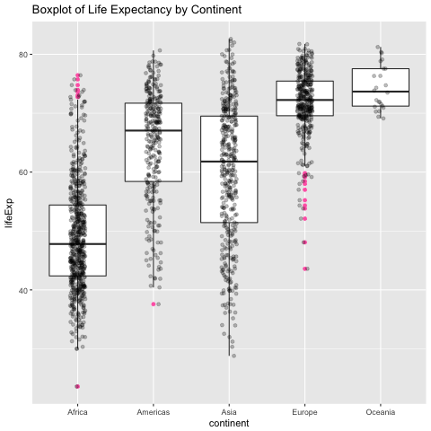
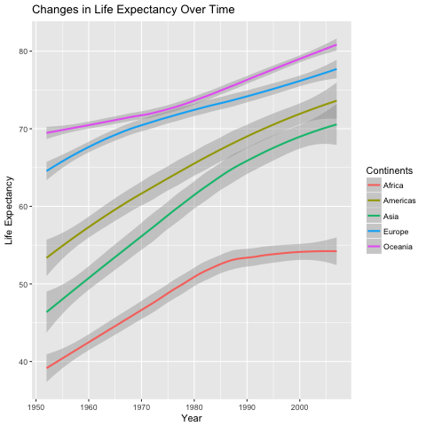

Homework 07
================
Peter Whitman
11/14/2017

``` r
library(tidyr)
library(tidyverse)
library(dplyr)
library(ggplot2)
library(ggforce)
library(ggplus)
library(knitr)
```

Download the data
=================

*To download the data I created a function -- download\_data() -- that can download data from a url. Please refer to the [exploratory.R](https://github.com/peterwhitman/STAT545-whitman-peter/blob/master/hw07/R/exploratory.R) script in the R folder for the function.*

Exploratory Analysis
====================

*To read the data, I created a second function -- read() -- whichs reads the downloaded .csv file into a dataframe.*

*Below, I've created some descriptive plots. You can view the source files for the boxplot [here](https://github.com/peterwhitman/STAT545-whitman-peter/blob/master/hw07/figures/LifeExp_BoxPlot.png) and the change over time plot [here](https://github.com/peterwhitman/STAT545-whitman-peter/blob/master/hw07/figures/LifeExp_OverTime.png). You can view the functions that I developed to create the plots in the [exploratory.R](https://github.com/peterwhitman/STAT545-whitman-peter/blob/master/hw07/R/exploratory.R) script*

 

*plot 1. life expectancy for each continent, with outliers in pink*

 

*plot. 2 the changes in life expectancy over time by continent*

*The reordered gapminder data can be found [here](https://github.com/peterwhitman/STAT545-whitman-peter/blob/master/hw07/data/ReorderContinents_MeanLifeExp.csv). The function that I used to read, plot, and reorder the data can be found in the [exploratory.R](https://github.com/peterwhitman/STAT545-whitman-peter/blob/master/hw07/R/exploratory.R) script.*

Statistical Analysis
====================

*I fit a linear regression of life expectancy on year within each country. The function that I used to complete this task can be found in the [statistical.R](https://github.com/peterwhitman/STAT545-whitman-peter/blob/master/hw07/R/statistical.R) script and the source file for this table can be found (here)[https://github.com/peterwhitman/STAT545-whitman-peter/blob/master/hw07/data/Table_lm.csv]. The below table is the ouput of this function.*

``` r
Table_lm <- read.csv("data/Table_lm.csv")
kable(Table_lm)
```

| country                  | continent | term           |    estimate|  std.error|    statistic|    p.value|
|:-------------------------|:----------|:---------------|-----------:|----------:|------------:|----------:|
| Afghanistan              | Asia      | (Intercept)    |  29.9072949|  0.6639995|   45.0411380|  0.0000000|
| Afghanistan              | Asia      | I(year - 1952) |   0.2753287|  0.0204509|   13.4628901|  0.0000001|
| Albania                  | Europe    | (Intercept)    |  59.2291282|  1.0768440|   55.0025133|  0.0000000|
| Albania                  | Europe    | I(year - 1952) |   0.3346832|  0.0331664|   10.0910363|  0.0000015|
| Algeria                  | Africa    | (Intercept)    |  43.3749744|  0.7184202|   60.3754908|  0.0000000|
| Algeria                  | Africa    | I(year - 1952) |   0.5692797|  0.0221271|   25.7277493|  0.0000000|
| Angola                   | Africa    | (Intercept)    |  32.1266538|  0.7640355|   42.0486406|  0.0000000|
| Angola                   | Africa    | I(year - 1952) |   0.2093399|  0.0235320|    8.8959644|  0.0000046|
| Argentina                | Americas  | (Intercept)    |  62.6884359|  0.1587289|  394.9401840|  0.0000000|
| Argentina                | Americas  | I(year - 1952) |   0.2317084|  0.0048888|   47.3958474|  0.0000000|
| Australia                | Oceania   | (Intercept)    |  68.4005128|  0.3370035|  202.9667805|  0.0000000|
| Australia                | Oceania   | I(year - 1952) |   0.2277238|  0.0103796|   21.9395958|  0.0000000|
| Austria                  | Europe    | (Intercept)    |  66.4484615|  0.2212318|  300.3566755|  0.0000000|
| Austria                  | Europe    | I(year - 1952) |   0.2419923|  0.0068139|   35.5147334|  0.0000000|
| Bahrain                  | Asia      | (Intercept)    |  52.7492051|  0.8903299|   59.2468082|  0.0000000|
| Bahrain                  | Asia      | I(year - 1952) |   0.4675077|  0.0274218|   17.0487460|  0.0000000|
| Bangladesh               | Asia      | (Intercept)    |  36.1354872|  0.5303636|   68.1334197|  0.0000000|
| Bangladesh               | Asia      | I(year - 1952) |   0.4981308|  0.0163350|   30.4946941|  0.0000000|
| Belgium                  | Europe    | (Intercept)    |  67.8919231|  0.1590522|  426.8530986|  0.0000000|
| Belgium                  | Europe    | I(year - 1952) |   0.2090846|  0.0048987|   42.6812417|  0.0000000|
| Benin                    | Africa    | (Intercept)    |  39.5885128|  0.6378819|   62.0624528|  0.0000000|
| Benin                    | Africa    | I(year - 1952) |   0.3342329|  0.0196465|   17.0123200|  0.0000000|
| Bolivia                  | Americas  | (Intercept)    |  38.7564487|  0.6431784|   60.2576941|  0.0000000|
| Bolivia                  | Americas  | I(year - 1952) |   0.4999322|  0.0198097|   25.2367982|  0.0000000|
| Bosnia and Herzegovina   | Europe    | (Intercept)    |  58.0895641|  1.2254165|   47.4039345|  0.0000000|
| Bosnia and Herzegovina   | Europe    | I(year - 1952) |   0.3497552|  0.0377424|    9.2669143|  0.0000032|
| Botswana                 | Africa    | (Intercept)    |  52.9291154|  3.3190406|   15.9471131|  0.0000000|
| Botswana                 | Africa    | I(year - 1952) |   0.0606685|  0.1022252|    0.5934793|  0.5660414|
| Brazil                   | Americas  | (Intercept)    |  51.5120385|  0.1771529|  290.7772493|  0.0000000|
| Brazil                   | Americas  | I(year - 1952) |   0.3900895|  0.0054562|   71.4941652|  0.0000000|
| Bulgaria                 | Europe    | (Intercept)    |  65.7373077|  1.3625030|   48.2474602|  0.0000000|
| Bulgaria                 | Europe    | I(year - 1952) |   0.1456888|  0.0419646|    3.4717095|  0.0060039|
| Burkina Faso             | Africa    | (Intercept)    |  34.6846923|  1.1116136|   31.2021109|  0.0000000|
| Burkina Faso             | Africa    | I(year - 1952) |   0.3639748|  0.0342373|   10.6309510|  0.0000009|
| Burundi                  | Africa    | (Intercept)    |  40.5786410|  0.8746862|   46.3922288|  0.0000000|
| Burundi                  | Africa    | I(year - 1952) |   0.1541343|  0.0269400|    5.7213903|  0.0001926|
| Cambodia                 | Asia      | (Intercept)    |  37.0154231|  3.0572859|   12.1072821|  0.0000003|
| Cambodia                 | Asia      | I(year - 1952) |   0.3959028|  0.0941632|    4.2044303|  0.0018159|
| Cameroon                 | Africa    | (Intercept)    |  41.2494615|  1.7611331|   23.4221154|  0.0000000|
| Cameroon                 | Africa    | I(year - 1952) |   0.2501469|  0.0542422|    4.6116625|  0.0009628|
| Canada                   | Americas  | (Intercept)    |  68.8838462|  0.1353471|  508.9423360|  0.0000000|
| Canada                   | Americas  | I(year - 1952) |   0.2188692|  0.0041686|   52.5037764|  0.0000000|
| Central African Republic | Africa    | (Intercept)    |  38.8095128|  1.9138932|   20.2777835|  0.0000000|
| Central African Republic | Africa    | I(year - 1952) |   0.1839056|  0.0589472|    3.1198368|  0.0108770|
| Chad                     | Africa    | (Intercept)    |  39.8093718|  0.9945101|   40.0291284|  0.0000000|
| Chad                     | Africa    | I(year - 1952) |   0.2532441|  0.0306305|    8.2677000|  0.0000088|
| Chile                    | Americas  | (Intercept)    |  54.3177051|  0.6477388|   83.8574234|  0.0000000|
| Chile                    | Americas  | I(year - 1952) |   0.4768441|  0.0199501|   23.9018278|  0.0000000|
| China                    | Asia      | (Intercept)    |  47.1904815|  2.0944268|   22.5314547|  0.0000000|
| China                    | Asia      | I(year - 1952) |   0.5307149|  0.0645075|    8.2271744|  0.0000092|
| Colombia                 | Americas  | (Intercept)    |  53.4271154|  0.7122259|   75.0142863|  0.0000000|
| Colombia                 | Americas  | I(year - 1952) |   0.3807503|  0.0219363|   17.3571016|  0.0000000|
| Comoros                  | Africa    | (Intercept)    |  39.9960000|  0.2599153|  153.8809110|  0.0000000|
| Comoros                  | Africa    | I(year - 1952) |   0.4503909|  0.0080053|   56.2616474|  0.0000000|
| Congo, Dem. Rep.         | Africa    | (Intercept)    |  41.9610769|  1.3192634|   31.8064432|  0.0000000|
| Congo, Dem. Rep.         | Africa    | I(year - 1952) |   0.0939154|  0.0406328|    2.3113189|  0.0434098|
| Congo, Rep.              | Africa    | (Intercept)    |  47.1367821|  1.9258241|   24.4761616|  0.0000000|
| Congo, Rep.              | Africa    | I(year - 1952) |   0.1950958|  0.0593147|    3.2891672|  0.0081615|
| Costa Rica               | Americas  | (Intercept)    |  59.1047051|  0.8247668|   71.6623257|  0.0000000|
| Costa Rica               | Americas  | I(year - 1952) |   0.4027895|  0.0254025|   15.8562920|  0.0000000|
| Cote d'Ivoire            | Africa    | (Intercept)    |  44.8458590|  2.1316780|   21.0378205|  0.0000000|
| Cote d'Ivoire            | Africa    | I(year - 1952) |   0.1305566|  0.0656549|    1.9885294|  0.0748035|
| Croatia                  | Europe    | (Intercept)    |  63.8557821|  0.6231467|  102.4731166|  0.0000000|
| Croatia                  | Europe    | I(year - 1952) |   0.2254594|  0.0191927|   11.7471572|  0.0000004|
| Cuba                     | Americas  | (Intercept)    |  62.2134487|  0.9452051|   65.8200486|  0.0000000|
| Cuba                     | Americas  | I(year - 1952) |   0.3211503|  0.0291120|   11.0315608|  0.0000006|
| Czech Republic           | Europe    | (Intercept)    |  67.5280769|  0.4482597|  150.6449973|  0.0000000|
| Czech Republic           | Europe    | I(year - 1952) |   0.1448154|  0.0138062|   10.4891350|  0.0000010|
| Denmark                  | Europe    | (Intercept)    |  71.0335897|  0.2165503|  328.0235293|  0.0000000|
| Denmark                  | Europe    | I(year - 1952) |   0.1213301|  0.0066697|   18.1913245|  0.0000000|
| Djibouti                 | Africa    | (Intercept)    |  36.2771538|  0.6117847|   59.2972589|  0.0000000|
| Djibouti                 | Africa    | I(year - 1952) |   0.3674035|  0.0188427|   19.4984162|  0.0000000|
| Dominican Republic       | Americas  | (Intercept)    |  48.5978077|  0.8418024|   57.7306625|  0.0000000|
| Dominican Republic       | Americas  | I(year - 1952) |   0.4711524|  0.0259272|   18.1721350|  0.0000000|
| Ecuador                  | Americas  | (Intercept)    |  49.0653718|  0.3794927|  129.2919981|  0.0000000|
| Ecuador                  | Americas  | I(year - 1952) |   0.5000531|  0.0116882|   42.7826181|  0.0000000|
| Egypt                    | Africa    | (Intercept)    |  40.9680000|  0.5642996|   72.5997359|  0.0000000|
| Egypt                    | Africa    | I(year - 1952) |   0.5554545|  0.0173802|   31.9590192|  0.0000000|
| El Salvador              | Americas  | (Intercept)    |  46.5119487|  1.0550820|   44.0837280|  0.0000000|
| El Salvador              | Americas  | I(year - 1952) |   0.4771413|  0.0324961|   14.6830200|  0.0000000|
| Equatorial Guinea        | Africa    | (Intercept)    |  34.4303077|  0.1784855|  192.9025844|  0.0000000|
| Equatorial Guinea        | Africa    | I(year - 1952) |   0.3101706|  0.0054973|   56.4225166|  0.0000000|
| Eritrea                  | Africa    | (Intercept)    |  35.6952692|  0.8127528|   43.9189743|  0.0000000|
| Eritrea                  | Africa    | I(year - 1952) |   0.3746902|  0.0250325|   14.9681633|  0.0000000|
| Ethiopia                 | Africa    | (Intercept)    |  36.0281538|  0.5687767|   63.3432288|  0.0000000|
| Ethiopia                 | Africa    | I(year - 1952) |   0.3071853|  0.0175181|   17.5353031|  0.0000000|
| Finland                  | Europe    | (Intercept)    |  66.4489744|  0.1923471|  345.4638421|  0.0000000|
| Finland                  | Europe    | I(year - 1952) |   0.2379252|  0.0059242|   40.1614472|  0.0000000|
| France                   | Europe    | (Intercept)    |  67.7901282|  0.1194901|  567.3286078|  0.0000000|
| France                   | Europe    | I(year - 1952) |   0.2385014|  0.0036802|   64.8057884|  0.0000000|
| Gabon                    | Africa    | (Intercept)    |  38.9353462|  2.2014653|   17.6861049|  0.0000000|
| Gabon                    | Africa    | I(year - 1952) |   0.4467329|  0.0678043|    6.5885630|  0.0000617|
| Gambia                   | Africa    | (Intercept)    |  28.4003718|  0.6231497|   45.5755195|  0.0000000|
| Gambia                   | Africa    | I(year - 1952) |   0.5818259|  0.0191928|   30.3148395|  0.0000000|
| Germany                  | Europe    | (Intercept)    |  67.5681282|  0.2259399|  299.0534867|  0.0000000|
| Germany                  | Europe    | I(year - 1952) |   0.2136832|  0.0069589|   30.7066214|  0.0000000|
| Ghana                    | Africa    | (Intercept)    |  43.4927436|  0.4199135|  103.5754925|  0.0000000|
| Ghana                    | Africa    | I(year - 1952) |   0.3217427|  0.0129332|   24.8773139|  0.0000000|
| Greece                   | Europe    | (Intercept)    |  67.0672051|  0.4227103|  158.6599807|  0.0000000|
| Greece                   | Europe    | I(year - 1952) |   0.2423986|  0.0130193|   18.6183821|  0.0000000|
| Guatemala                | Americas  | (Intercept)    |  42.1193974|  0.3155924|  133.4613956|  0.0000000|
| Guatemala                | Americas  | I(year - 1952) |   0.5312734|  0.0097201|   54.6570573|  0.0000000|
| Guinea                   | Africa    | (Intercept)    |  31.5569872|  0.6493953|   48.5944181|  0.0000000|
| Guinea                   | Africa    | I(year - 1952) |   0.4248308|  0.0200011|   21.2403396|  0.0000000|
| Guinea-Bissau            | Africa    | (Intercept)    |  31.7370385|  0.3494267|   90.8260140|  0.0000000|
| Guinea-Bissau            | Africa    | I(year - 1952) |   0.2717531|  0.0107622|   25.2506800|  0.0000000|
| Haiti                    | Americas  | (Intercept)    |  39.2461538|  0.4565534|   85.9617962|  0.0000000|
| Haiti                    | Americas  | I(year - 1952) |   0.3970580|  0.0140617|   28.2369000|  0.0000000|
| Honduras                 | Americas  | (Intercept)    |  42.9924103|  0.8494393|   50.6126916|  0.0000000|
| Honduras                 | Americas  | I(year - 1952) |   0.5428517|  0.0261624|   20.7493034|  0.0000000|
| Hong Kong, China         | Asia      | (Intercept)    |  63.4286410|  0.6341995|  100.0137073|  0.0000000|
| Hong Kong, China         | Asia      | I(year - 1952) |   0.3659706|  0.0195331|   18.7359186|  0.0000000|
| Hungary                  | Europe    | (Intercept)    |  65.9928205|  0.6446344|  102.3724815|  0.0000000|
| Hungary                  | Europe    | I(year - 1952) |   0.1236490|  0.0198545|    6.2277564|  0.0000978|
| Iceland                  | Europe    | (Intercept)    |  71.9635897|  0.2969278|  242.3605919|  0.0000000|
| Iceland                  | Europe    | I(year - 1952) |   0.1653755|  0.0091453|   18.0831906|  0.0000000|
| India                    | Asia      | (Intercept)    |  39.2697564|  0.9366533|   41.9256055|  0.0000000|
| India                    | Asia      | I(year - 1952) |   0.5053210|  0.0288486|   17.5163294|  0.0000000|
| Indonesia                | Asia      | (Intercept)    |  36.8831154|  0.3505460|  105.2161840|  0.0000000|
| Indonesia                | Asia      | I(year - 1952) |   0.6346413|  0.0107967|   58.7811248|  0.0000000|
| Iran                     | Asia      | (Intercept)    |  44.9789872|  0.3609096|  124.6267312|  0.0000000|
| Iran                     | Asia      | I(year - 1952) |   0.4966399|  0.0111159|   44.6784137|  0.0000000|
| Iraq                     | Asia      | (Intercept)    |  50.1134615|  2.2030886|   22.7469116|  0.0000000|
| Iraq                     | Asia      | I(year - 1952) |   0.2352105|  0.0678543|    3.4664055|  0.0060574|
| Ireland                  | Europe    | (Intercept)    |  67.5414615|  0.2594848|  260.2906377|  0.0000000|
| Ireland                  | Europe    | I(year - 1952) |   0.1991196|  0.0079920|   24.9147596|  0.0000000|
| Israel                   | Asia      | (Intercept)    |  66.3004103|  0.1986046|  333.8312655|  0.0000000|
| Israel                   | Asia      | I(year - 1952) |   0.2671063|  0.0061169|   43.6666177|  0.0000000|
| Italy                    | Europe    | (Intercept)    |  66.5967949|  0.2262984|  294.2874934|  0.0000000|
| Italy                    | Europe    | I(year - 1952) |   0.2697105|  0.0069699|   38.6964348|  0.0000000|
| Jamaica                  | Americas  | (Intercept)    |  62.6609872|  1.1164205|   56.1266880|  0.0000000|
| Jamaica                  | Americas  | I(year - 1952) |   0.2213944|  0.0343853|    6.4386299|  0.0000746|
| Japan                    | Asia      | (Intercept)    |  65.1220513|  0.7435009|   87.5883981|  0.0000000|
| Japan                    | Asia      | I(year - 1952) |   0.3529042|  0.0228995|   15.4109699|  0.0000000|
| Jordan                   | Asia      | (Intercept)    |  44.0638590|  1.0367579|   42.5015888|  0.0000000|
| Jordan                   | Asia      | I(year - 1952) |   0.5717294|  0.0319318|   17.9047301|  0.0000000|
| Kenya                    | Africa    | (Intercept)    |  47.0020385|  2.3796125|   19.7519713|  0.0000000|
| Kenya                    | Africa    | I(year - 1952) |   0.2065077|  0.0732912|    2.8176343|  0.0182345|
| Korea, Dem. Rep.         | Asia      | (Intercept)    |  54.9056026|  2.1113613|   26.0048349|  0.0000000|
| Korea, Dem. Rep.         | Asia      | I(year - 1952) |   0.3164266|  0.0650291|    4.8659207|  0.0006556|
| Korea, Rep.              | Asia      | (Intercept)    |  49.7275000|  0.6376384|   77.9869873|  0.0000000|
| Korea, Rep.              | Asia      | I(year - 1952) |   0.5554000|  0.0196390|   28.2804316|  0.0000000|
| Kuwait                   | Asia      | (Intercept)    |  57.4593333|  0.9572671|   60.0243447|  0.0000000|
| Kuwait                   | Asia      | I(year - 1952) |   0.4168364|  0.0294835|   14.1379709|  0.0000001|
| Lebanon                  | Asia      | (Intercept)    |  58.6873590|  0.6666838|   88.0287817|  0.0000000|
| Lebanon                  | Asia      | I(year - 1952) |   0.2610294|  0.0205336|   12.7123002|  0.0000002|
| Lesotho                  | Africa    | (Intercept)    |  47.3790256|  3.2222504|   14.7037068|  0.0000000|
| Lesotho                  | Africa    | I(year - 1952) |   0.0955657|  0.0992441|    0.9629363|  0.3582864|
| Liberia                  | Africa    | (Intercept)    |  39.8364231|  0.9626846|   41.3805535|  0.0000000|
| Liberia                  | Africa    | I(year - 1952) |   0.0959937|  0.0296503|    3.2375267|  0.0089067|
| Libya                    | Africa    | (Intercept)    |  42.1019359|  0.8361903|   50.3497075|  0.0000000|
| Libya                    | Africa    | I(year - 1952) |   0.6255357|  0.0257543|   24.2885507|  0.0000000|
| Madagascar               | Africa    | (Intercept)    |  36.6680641|  0.3039041|  120.6567019|  0.0000000|
| Madagascar               | Africa    | I(year - 1952) |   0.4037280|  0.0093601|   43.1327301|  0.0000000|
| Malawi                   | Africa    | (Intercept)    |  36.9103718|  1.0497440|   35.1613060|  0.0000000|
| Malawi                   | Africa    | I(year - 1952) |   0.2342259|  0.0323317|    7.2444611|  0.0000278|
| Malaysia                 | Asia      | (Intercept)    |  51.5052179|  1.1338366|   45.4256107|  0.0000000|
| Malaysia                 | Asia      | I(year - 1952) |   0.4645224|  0.0349217|   13.3018126|  0.0000001|
| Mali                     | Africa    | (Intercept)    |  33.0512308|  0.2615203|  126.3811188|  0.0000000|
| Mali                     | Africa    | I(year - 1952) |   0.3768098|  0.0080547|   46.7812021|  0.0000000|
| Mauritania               | Africa    | (Intercept)    |  40.0256026|  0.2212986|  180.8669510|  0.0000000|
| Mauritania               | Africa    | I(year - 1952) |   0.4464175|  0.0068159|   65.4963612|  0.0000000|
| Mauritius                | Africa    | (Intercept)    |  55.3707692|  0.9449728|   58.5950916|  0.0000000|
| Mauritius                | Africa    | I(year - 1952) |   0.3484538|  0.0291048|   11.9723825|  0.0000003|
| Mexico                   | Americas  | (Intercept)    |  53.0053718|  0.5675020|   93.4012083|  0.0000000|
| Mexico                   | Americas  | I(year - 1952) |   0.4510350|  0.0174788|   25.8046195|  0.0000000|
| Mongolia                 | Asia      | (Intercept)    |  43.8264103|  0.5105767|   85.8370783|  0.0000000|
| Mongolia                 | Asia      | I(year - 1952) |   0.4386881|  0.0157256|   27.8964880|  0.0000000|
| Montenegro               | Europe    | (Intercept)    |  62.2416282|  1.4953884|   41.6223816|  0.0000000|
| Montenegro               | Europe    | I(year - 1952) |   0.2930014|  0.0460574|    6.3616580|  0.0000823|
| Morocco                  | Africa    | (Intercept)    |  42.6908333|  0.4110424|  103.8599306|  0.0000000|
| Morocco                  | Africa    | I(year - 1952) |   0.5424727|  0.0126599|   42.8495183|  0.0000000|
| Mozambique               | Africa    | (Intercept)    |  34.2061538|  1.2444557|   27.4868403|  0.0000000|
| Mozambique               | Africa    | I(year - 1952) |   0.2244853|  0.0383288|    5.8568372|  0.0001601|
| Myanmar                  | Asia      | (Intercept)    |  41.4115513|  1.6468893|   25.1453162|  0.0000000|
| Myanmar                  | Asia      | I(year - 1952) |   0.4330951|  0.0507236|    8.5383414|  0.0000066|
| Namibia                  | Africa    | (Intercept)    |  47.1343333|  2.6938198|   17.4972109|  0.0000000|
| Namibia                  | Africa    | I(year - 1952) |   0.2311636|  0.0829686|    2.7861572|  0.0192463|
| Nepal                    | Asia      | (Intercept)    |  34.4316410|  0.5018926|   68.6035998|  0.0000000|
| Nepal                    | Asia      | I(year - 1952) |   0.5292615|  0.0154581|   34.2384549|  0.0000000|
| Netherlands              | Europe    | (Intercept)    |  71.8896154|  0.1888411|  380.6884906|  0.0000000|
| Netherlands              | Europe    | I(year - 1952) |   0.1366867|  0.0058162|   23.5009018|  0.0000000|
| New Zealand              | Oceania   | (Intercept)    |  68.6869231|  0.4367774|  157.2584230|  0.0000000|
| New Zealand              | Oceania   | I(year - 1952) |   0.1928210|  0.0134526|   14.3333854|  0.0000001|
| Nicaragua                | Americas  | (Intercept)    |  43.0451282|  0.3249554|  132.4647330|  0.0000000|
| Nicaragua                | Americas  | I(year - 1952) |   0.5565196|  0.0100085|   55.6046808|  0.0000000|
| Niger                    | Africa    | (Intercept)    |  35.1506667|  1.1858317|   29.6422065|  0.0000000|
| Niger                    | Africa    | I(year - 1952) |   0.3421091|  0.0365232|    9.3669072|  0.0000029|
| Nigeria                  | Africa    | (Intercept)    |  37.8595256|  0.8254019|   45.8679918|  0.0000000|
| Nigeria                  | Africa    | I(year - 1952) |   0.2080657|  0.0254221|    8.1844549|  0.0000096|
| Norway                   | Europe    | (Intercept)    |  72.2146154|  0.2659060|  271.5794891|  0.0000000|
| Norway                   | Europe    | I(year - 1952) |   0.1319413|  0.0081898|   16.1104298|  0.0000000|
| Oman                     | Asia      | (Intercept)    |  37.2077436|  1.2748610|   29.1857262|  0.0000000|
| Oman                     | Asia      | I(year - 1952) |   0.7721790|  0.0392652|   19.6657180|  0.0000000|
| Pakistan                 | Asia      | (Intercept)    |  43.7229615|  0.2188015|  199.8293669|  0.0000000|
| Pakistan                 | Asia      | I(year - 1952) |   0.4057923|  0.0067390|   60.2154854|  0.0000000|
| Panama                   | Americas  | (Intercept)    |  58.0610000|  0.8237795|   70.4812405|  0.0000000|
| Panama                   | Americas  | I(year - 1952) |   0.3542091|  0.0253721|   13.9605771|  0.0000001|
| Paraguay                 | Americas  | (Intercept)    |  62.4818333|  0.2125480|  293.9657785|  0.0000000|
| Paraguay                 | Americas  | I(year - 1952) |   0.1573545|  0.0065464|   24.0368163|  0.0000000|
| Peru                     | Americas  | (Intercept)    |  44.3476410|  0.5850548|   75.8008372|  0.0000000|
| Peru                     | Americas  | I(year - 1952) |   0.5276979|  0.0180195|   29.2848825|  0.0000000|
| Philippines              | Asia      | (Intercept)    |  49.4043462|  0.4015479|  123.0347550|  0.0000000|
| Philippines              | Asia      | I(year - 1952) |   0.4204692|  0.0123675|   33.9978547|  0.0000000|
| Poland                   | Europe    | (Intercept)    |  64.7808974|  0.8803585|   73.5846779|  0.0000000|
| Poland                   | Europe    | I(year - 1952) |   0.1962189|  0.0271147|    7.2366217|  0.0000280|
| Portugal                 | Europe    | (Intercept)    |  61.1467949|  0.6188839|   98.8017144|  0.0000000|
| Portugal                 | Europe    | I(year - 1952) |   0.3372014|  0.0190614|   17.6902834|  0.0000000|
| Puerto Rico              | Americas  | (Intercept)    |  66.9485256|  0.6889407|   97.1760333|  0.0000000|
| Puerto Rico              | Americas  | I(year - 1952) |   0.2105748|  0.0212191|    9.9238282|  0.0000017|
| Reunion                  | Africa    | (Intercept)    |  53.9975385|  0.8848614|   61.0237263|  0.0000000|
| Reunion                  | Africa    | I(year - 1952) |   0.4598804|  0.0272534|   16.8742438|  0.0000000|
| Romania                  | Europe    | (Intercept)    |  63.9621282|  0.7939586|   80.5610377|  0.0000000|
| Romania                  | Europe    | I(year - 1952) |   0.1574014|  0.0244536|    6.4367312|  0.0000747|
| Rwanda                   | Africa    | (Intercept)    |  42.7419487|  3.5612780|   12.0018569|  0.0000003|
| Rwanda                   | Africa    | I(year - 1952) |  -0.0458315|  0.1096860|   -0.4178424|  0.6848927|
| Sao Tome and Principe    | Africa    | (Intercept)    |  48.5275641|  0.7569984|   64.1052436|  0.0000000|
| Sao Tome and Principe    | Africa    | I(year - 1952) |   0.3406825|  0.0233153|   14.6119962|  0.0000000|
| Saudi Arabia             | Asia      | (Intercept)    |  40.8141154|  1.1302842|   36.1096035|  0.0000000|
| Saudi Arabia             | Asia      | I(year - 1952) |   0.6496231|  0.0348123|   18.6607208|  0.0000000|
| Senegal                  | Africa    | (Intercept)    |  36.7466667|  0.5062917|   72.5800250|  0.0000000|
| Senegal                  | Africa    | I(year - 1952) |   0.5047000|  0.0155936|   32.3658568|  0.0000000|
| Serbia                   | Europe    | (Intercept)    |  61.5343462|  0.9728532|   63.2514188|  0.0000000|
| Serbia                   | Europe    | I(year - 1952) |   0.2551510|  0.0299635|    8.5153927|  0.0000068|
| Sierra Leone             | Africa    | (Intercept)    |  30.8832051|  0.4476936|   68.9829004|  0.0000000|
| Sierra Leone             | Africa    | I(year - 1952) |   0.2140350|  0.0137888|   15.5223850|  0.0000000|
| Singapore                | Asia      | (Intercept)    |  61.8458846|  0.3865763|  159.9836319|  0.0000000|
| Singapore                | Asia      | I(year - 1952) |   0.3408860|  0.0119064|   28.6304760|  0.0000000|
| Slovak Republic          | Europe    | (Intercept)    |  67.0098718|  0.7058347|   94.9370587|  0.0000000|
| Slovak Republic          | Europe    | I(year - 1952) |   0.1340441|  0.0217394|    6.1659385|  0.0001061|
| Slovenia                 | Europe    | (Intercept)    |  66.0863462|  0.3859981|  171.2090036|  0.0000000|
| Slovenia                 | Europe    | I(year - 1952) |   0.2005238|  0.0118886|   16.8669040|  0.0000000|
| Somalia                  | Africa    | (Intercept)    |  34.6753974|  1.0117183|   34.2737665|  0.0000000|
| Somalia                  | Africa    | I(year - 1952) |   0.2295734|  0.0311605|    7.3674406|  0.0000240|
| South Africa             | Africa    | (Intercept)    |  49.3412821|  2.5762850|   19.1521055|  0.0000000|
| South Africa             | Africa    | I(year - 1952) |   0.1691594|  0.0793486|    2.1318516|  0.0588374|
| Spain                    | Europe    | (Intercept)    |  66.4778205|  0.5501755|  120.8302077|  0.0000000|
| Spain                    | Europe    | I(year - 1952) |   0.2809308|  0.0169452|   16.5787849|  0.0000000|
| Sri Lanka                | Asia      | (Intercept)    |  59.7914872|  0.5905879|  101.2406291|  0.0000000|
| Sri Lanka                | Asia      | I(year - 1952) |   0.2448944|  0.0181899|   13.4632213|  0.0000001|
| Sudan                    | Africa    | (Intercept)    |  37.8741923|  0.3497480|  108.2899596|  0.0000000|
| Sudan                    | Africa    | I(year - 1952) |   0.3827748|  0.0107721|   35.5338953|  0.0000000|
| Swaziland                | Africa    | (Intercept)    |  46.3878590|  3.6078810|   12.8573693|  0.0000002|
| Swaziland                | Africa    | I(year - 1952) |   0.0950748|  0.1111214|    0.8555945|  0.4122530|
| Sweden                   | Europe    | (Intercept)    |  71.6050000|  0.1149944|  622.6824663|  0.0000000|
| Sweden                   | Europe    | I(year - 1952) |   0.1662545|  0.0035418|   46.9409047|  0.0000000|
| Switzerland              | Europe    | (Intercept)    |  69.4537179|  0.1167014|  595.1402162|  0.0000000|
| Switzerland              | Europe    | I(year - 1952) |   0.2222315|  0.0035944|   61.8278287|  0.0000000|
| Syria                    | Asia      | (Intercept)    |  46.1012821|  0.7219705|   63.8548013|  0.0000000|
| Syria                    | Asia      | I(year - 1952) |   0.5543594|  0.0222364|   24.9302505|  0.0000000|
| Taiwan                   | Asia      | (Intercept)    |  61.3374359|  0.7115902|   86.1977012|  0.0000000|
| Taiwan                   | Asia      | I(year - 1952) |   0.3272448|  0.0219167|   14.9312924|  0.0000000|
| Tanzania                 | Africa    | (Intercept)    |  43.1084103|  0.9962395|   43.2711308|  0.0000000|
| Tanzania                 | Africa    | I(year - 1952) |   0.1746881|  0.0306838|    5.6931710|  0.0002002|
| Thailand                 | Asia      | (Intercept)    |  52.6564231|  0.6542710|   80.4810618|  0.0000000|
| Thailand                 | Asia      | I(year - 1952) |   0.3470483|  0.0201513|   17.2221292|  0.0000000|
| Togo                     | Africa    | (Intercept)    |  40.9774615|  1.2667493|   32.3485165|  0.0000000|
| Togo                     | Africa    | I(year - 1952) |   0.3825923|  0.0390154|    9.8061875|  0.0000019|
| Trinidad and Tobago      | Americas  | (Intercept)    |  62.0523077|  0.8970621|   69.1728140|  0.0000000|
| Trinidad and Tobago      | Americas  | I(year - 1952) |   0.1736615|  0.0276292|    6.2854415|  0.0000908|
| Tunisia                  | Africa    | (Intercept)    |  44.5553077|  0.8466003|   52.6285040|  0.0000000|
| Tunisia                  | Africa    | I(year - 1952) |   0.5878434|  0.0260750|   22.5443559|  0.0000000|
| Turkey                   | Europe    | (Intercept)    |  46.0223205|  0.6228809|   73.8862236|  0.0000000|
| Turkey                   | Europe    | I(year - 1952) |   0.4972399|  0.0191845|   25.9188383|  0.0000000|
| Uganda                   | Africa    | (Intercept)    |  44.2752179|  1.7309708|   25.5782581|  0.0000000|
| Uganda                   | Africa    | I(year - 1952) |   0.1215860|  0.0533132|    2.2805968|  0.0457393|
| United Kingdom           | Europe    | (Intercept)    |  68.8085256|  0.2400794|  286.6073191|  0.0000000|
| United Kingdom           | Europe    | I(year - 1952) |   0.1859657|  0.0073944|   25.1496875|  0.0000000|
| United States            | Americas  | (Intercept)    |  68.4138462|  0.2259695|  302.7570359|  0.0000000|
| United States            | Americas  | I(year - 1952) |   0.1841692|  0.0069598|   26.4619565|  0.0000000|
| Uruguay                  | Americas  | (Intercept)    |  65.7416026|  0.2897994|  226.8521098|  0.0000000|
| Uruguay                  | Americas  | I(year - 1952) |   0.1832720|  0.0089257|   20.5330451|  0.0000000|
| Venezuela                | Americas  | (Intercept)    |  57.5133205|  0.8046498|   71.4762155|  0.0000000|
| Venezuela                | Americas  | I(year - 1952) |   0.3297217|  0.0247829|   13.3043986|  0.0000001|
| Vietnam                  | Asia      | (Intercept)    |  39.0100769|  0.7133390|   54.6865858|  0.0000000|
| Vietnam                  | Asia      | I(year - 1952) |   0.6716154|  0.0219706|   30.5688625|  0.0000000|
| West Bank and Gaza       | Asia      | (Intercept)    |  43.7983974|  1.0763665|   40.6909686|  0.0000000|
| West Bank and Gaza       | Asia      | I(year - 1952) |   0.6011007|  0.0331517|   18.1318318|  0.0000000|
| Yemen, Rep.              | Asia      | (Intercept)    |  30.1302821|  0.8611216|   34.9895779|  0.0000000|
| Yemen, Rep.              | Asia      | I(year - 1952) |   0.6054594|  0.0265222|   22.8283857|  0.0000000|
| Zambia                   | Africa    | (Intercept)    |  47.6580256|  2.4591861|   19.3795930|  0.0000000|
| Zambia                   | Africa    | I(year - 1952) |  -0.0604252|  0.0757420|   -0.7977764|  0.4435318|
| Zimbabwe                 | Africa    | (Intercept)    |  55.2212436|  3.9127001|   14.1133340|  0.0000001|
| Zimbabwe                 | Africa    | I(year - 1952) |  -0.0930210|  0.1205097|   -0.7718963|  0.4580290|

*I found the countries within each continent with the highest and lowest intercepts. The function that I used to create this table can be found in the [statistical.R](https://github.com/peterwhitman/STAT545-whitman-peter/blob/master/hw07/R/statistical.R) script and the source file for this table can be found [here](https://github.com/peterwhitman/STAT545-whitman-peter/blob/master/hw07/data/Table_lm.csv)*

``` r
TopBottom_lm <- read.csv("data/TopBottom_lm.csv")
kable(TopBottom_lm)
```

| continent.x |  Intercept| country     |
|:------------|----------:|:------------|
| Africa      |   55.37077| Mauritius   |
| Africa      |   28.40037| Gambia      |
| Americas    |   68.88385| Canada      |
| Americas    |   38.75645| Bolivia     |
| Asia        |   66.30041| Israel      |
| Asia        |   29.90729| Afghanistan |
| Europe      |   72.21462| Norway      |
| Europe      |   46.02232| Turkey      |
| Oceania     |   68.68692| New Zealand |
| Oceania     |   68.40051| Australia   |

Generate Figures
================

*I created .pdf doucment with scatterplots of life expectancy vs. year, faceting on country, and fitted line overlaid. This is a large docoment, so I have not embedded it here. Please click [here](https://github.com/peterwhitman/STAT545-whitman-peter/blob/master/hw07/figures/Plot_lm.pdf) to see the document. The function that I used developed to create this file can be found in the [figures.R](https://github.com/peterwhitman/STAT545-whitman-peter/blob/master/hw07/R/figures.R) script*

Automate the pipeline
=====================

*This entire assignment was automated using remake instead of make. The YAML file, which was used to automate my pipeline can be found [here](https://github.com/peterwhitman/STAT545-whitman-peter/blob/master/hw07/remake.yml)*
