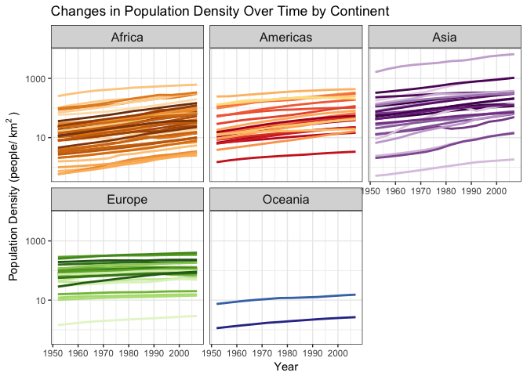

hw10
================
Peter Whitman
11/30/2017

Use an R package that wraps an API
==================================

I followed the first prompt. Specifically, I combined gapminder and geonames data to plot population density over time.

### 1. Make a user account and use geonames to access data about the world’s countries.

``` r
options(geonamesUsername="pwhitman") 
```

### 2. Make a dataframe out of the country info data from geonames

``` r
info <- GNcountryInfo()
head(info)
```

    ##   continent          capital         languages geonameId            south
    ## 1        EU Andorra la Vella                ca   3041565 42.4284925987684
    ## 2        AS        Abu Dhabi ar-AE,fa,en,hi,ur    290557 22.6333293914795
    ## 3        AS            Kabul fa-AF,ps,uz-AF,tk   1149361        29.377472
    ## 4        NA     Saint John’s             en-AG   3576396        16.996979
    ## 5        NA       The Valley             en-AI   3573511 18.1602929743117
    ## 6        EU           Tirana             sq,el    783754 39.6448624829142
    ##   isoAlpha3            north fipsCode population              east
    ## 1       AND    42.6560438963       AN      84000  1.78654277783198
    ## 2       ARE 26.0841598510742       AE    4975593  56.3816604614258
    ## 3       AFG        38.483418       AF   29121286         74.879448
    ## 4       ATG        17.729387       AC      86754        -61.672421
    ## 5       AIA 18.2769019716581       AV      13254 -62.9665554457795
    ## 6       ALB 42.6611669383269       AL    2986952  21.0574334835312
    ##   isoNumeric areaInSqKm countryCode              west
    ## 1        020      468.0          AD  1.40718671411128
    ## 2        784    82880.0          AE  51.5833282470703
    ## 3        004   647500.0          AF         60.478443
    ## 4        028      443.0          AG        -61.906425
    ## 5        660      102.0          AI -63.1680898960388
    ## 6        008    28748.0          AL  19.2639112711741
    ##                       countryName continentName currencyCode
    ## 1         Principality of Andorra        Europe          EUR
    ## 2            United Arab Emirates          Asia          AED
    ## 3 Islamic Republic of Afghanistan          Asia          AFN
    ## 4             Antigua and Barbuda North America          XCD
    ## 5                        Anguilla North America          XCD
    ## 6             Republic of Albania        Europe          ALL

### 3. Convert the country codes within the country info data frame to the english names they represent

``` r
info_updated <- info %>%
  mutate(country = countrycode(info$isoAlpha3, origin = "iso3c", destination = "country.name.en"))
```

    ## Warning in countrycode(info$isoAlpha3, origin = "iso3c", destination = "country.name.en"): Some values were not matched unambiguously: XKX

``` r
head(info_updated)
```

    ##   continent          capital         languages geonameId            south
    ## 1        EU Andorra la Vella                ca   3041565 42.4284925987684
    ## 2        AS        Abu Dhabi ar-AE,fa,en,hi,ur    290557 22.6333293914795
    ## 3        AS            Kabul fa-AF,ps,uz-AF,tk   1149361        29.377472
    ## 4        NA     Saint John’s             en-AG   3576396        16.996979
    ## 5        NA       The Valley             en-AI   3573511 18.1602929743117
    ## 6        EU           Tirana             sq,el    783754 39.6448624829142
    ##   isoAlpha3            north fipsCode population              east
    ## 1       AND    42.6560438963       AN      84000  1.78654277783198
    ## 2       ARE 26.0841598510742       AE    4975593  56.3816604614258
    ## 3       AFG        38.483418       AF   29121286         74.879448
    ## 4       ATG        17.729387       AC      86754        -61.672421
    ## 5       AIA 18.2769019716581       AV      13254 -62.9665554457795
    ## 6       ALB 42.6611669383269       AL    2986952  21.0574334835312
    ##   isoNumeric areaInSqKm countryCode              west
    ## 1        020      468.0          AD  1.40718671411128
    ## 2        784    82880.0          AE  51.5833282470703
    ## 3        004   647500.0          AF         60.478443
    ## 4        028      443.0          AG        -61.906425
    ## 5        660      102.0          AI -63.1680898960388
    ## 6        008    28748.0          AL  19.2639112711741
    ##                       countryName continentName currencyCode
    ## 1         Principality of Andorra        Europe          EUR
    ## 2            United Arab Emirates          Asia          AED
    ## 3 Islamic Republic of Afghanistan          Asia          AFN
    ## 4             Antigua and Barbuda North America          XCD
    ## 5                        Anguilla North America          XCD
    ## 6             Republic of Albania        Europe          ALL
    ##                country
    ## 1              Andorra
    ## 2 United Arab Emirates
    ## 3          Afghanistan
    ## 4  Antigua and Barbuda
    ## 5             Anguilla
    ## 6              Albania

### 4. Join the geonames data to gapminder data by country

``` r
country_joined <- left_join(gapminder, info_updated, by = "country")
```

    ## Warning: Column `country` joining factor and character vector, coercing
    ## into character vector

### 5. Create a new variable for population density by dividing population by area in sqkm

``` r
refined <- country_joined %>%
  mutate(area = as.numeric(areaInSqKm)) %>%
  select(country, continent.x, year, lifeExp, gdpPercap, pop, capital, area) %>%
  mutate(pop_density = pop/area)
kable(head(refined))
```

| country     | continent.x |  year|  lifeExp|  gdpPercap|       pop| capital |    area|  pop\_density|
|:------------|:------------|-----:|--------:|----------:|---------:|:--------|-------:|-------------:|
| Afghanistan | Asia        |  1952|   28.801|   779.4453|   8425333| Kabul   |  647500|      13.01210|
| Afghanistan | Asia        |  1957|   30.332|   820.8530|   9240934| Kabul   |  647500|      14.27171|
| Afghanistan | Asia        |  1962|   31.997|   853.1007|  10267083| Kabul   |  647500|      15.85650|
| Afghanistan | Asia        |  1967|   34.020|   836.1971|  11537966| Kabul   |  647500|      17.81925|
| Afghanistan | Asia        |  1972|   36.088|   739.9811|  13079460| Kabul   |  647500|      20.19994|
| Afghanistan | Asia        |  1977|   38.438|   786.1134|  14880372| Kabul   |  647500|      22.98127|

### 6. Vizualize the change in population density over time for each country faceted by continent using ggplot

``` r
p <- refined %>% 
  ggplot(aes(x = year, y = pop_density, group = country, color = country)) +
  geom_line(lwd = 1, show.legend = FALSE) + 
  facet_wrap(~ continent.x) +
  labs(x = "Year", y = "Population Density (people/" ~ km^{2} ~ ")", title = "Changes in Population Density Over Time by Continent") +
  scale_color_manual(values = country_colors) + 
  theme_bw() +
  theme(strip.text = element_text(size = rel(1.1))) + 
  scale_y_log10()
p
```

    ## Warning: Removed 240 rows containing missing values (geom_path).


